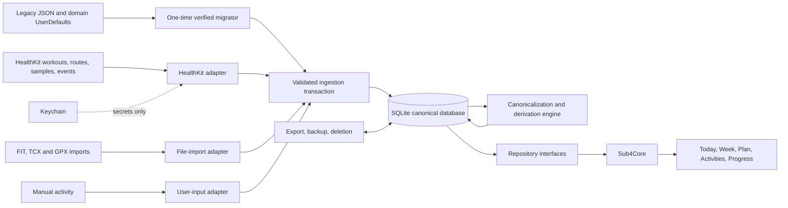

# Sub4 Current-State Peer Review and Remediation Plan

**Review date:** 2026-08-02  
**Scope:** Current active Xcode target in `Sub4.xcodeproj`, with source under `Sub4/`  
**Review basis:** Fresh inspection of the current worktree only; no conclusions were carried forward from an earlier pass  
**Build validation:** Unsigned Debug and Release builds for a generic iOS device both succeed with Xcode 26.6  
**Document status:** Engineering and product remediation plan, updated with the JSON-to-database and Strava-to-Apple-Health migration programs

## Purpose

This document records the current strengths, release risks, correctness defects, product gaps, and technical debt in Sub4. It also provides an ordered implementation plan for resolving every issue identified in the peer review.

The plan is intentionally dependency-driven. Later feature work depends on policy, data ownership, durability, and testability being resolved first.

## Executive verdict

Sub4 is already a substantial and unusually thoughtful personal marathon-training companion. Its strongest qualities are:

- Honest modeling of measured, estimated, partial, and unavailable data.
- Deep workout interpretation, training-load analysis, route, weather, shoe, commute, power, and heart-rate features.
- A coherent five-tab product structure and mature visual system.
- Good performance decisions such as day indexing, per-activity detail files, bounded streams, lazy detail cards, and binary-search playback.
- Defensive workout parsing that refuses unsupported prescriptions rather than creating a misleading workout.

It is not yet ready to ship publicly as a complete workout and activity tracker. The release blockers are:

1. The present use of Strava data appears incompatible with Strava's API Policy effective June 1, 2026.
2. Runtime truth is fragmented across monolithic JSON files, per-activity JSON files, domain-significant UserDefaults, and a bundled plan resource. There is no transaction spanning source records, canonical activities, dependent details, revisions, and synchronization state.
3. Original notes and review records can be lost without a visible save failure, and a decode failure can be mistaken for legitimately empty history.
4. The current source tree is not reproducibly stored in Git.
5. Privacy and consent disclosures do not match the actual HealthKit, AI, and weather data flows.
6. There is no automated test target or CI safety net.
7. Several synchronization, cancellation, token-refresh, matching, and cache-write races remain.

The best near-term product position is **a transparent marathon-training companion**. Becoming a general-purpose tracker requires a source-aware activity model, user-owned canonical data, manual/imported activities, editable plans, account scoping, synchronization, and a first-class activity library.

The next foundation milestone must perform two controlled migrations in order:

1. Introduce a source-neutral transactional database and migrate all authoritative JSON/UserDefaults domain state into verified repositories.
2. Ingest Apple Health directly into that database, reconcile permitted legacy Strava evidence, make Health the canonical source, and retire Strava.

The database migration is a **P0 prerequisite** for production HealthKit cutover. HealthKit discovery and test-fixture capture can proceed in parallel, but source activation must wait until database migration, provenance, recovery, and repository exit gates pass. Database activation and Health-primary activation must remain separate, independently reversible decisions.

### Immediate priority order

1. Preserve a reproducible repository baseline, add tests, and freeze unresolved provider paths.
2. Approve the storage/data-lifecycle decisions and implement the source-neutral canonical database.
3. Migrate every authoritative legacy JSON/UserDefaults record with backup, quarantine, verification, and rollback.
4. Complete HealthKit workout/route/sample/event ingestion into the database and shadow-reconcile it with permitted legacy Strava evidence.
5. Activate Health as canonical, then stop Strava sync, revoke OAuth, remove Strava code/UI, and purge restricted lineage.
6. Continue with concurrency, domain correctness, activity-library, plan, accessibility, and product expansion work in the dependency order below.

## Current project snapshot

| Area | Current state |
|---|---|
| Active application target | One target and one scheme: `Sub4` |
| Active Swift source | 86 files, approximately 31,488 lines |
| Build | Debug and Release generic-device builds pass with signing disabled |
| Automated tests | No XCTest target, test plan, package tests, or CI |
| Product navigation | Today, Week, Plan, Progress, Settings |
| Minimum OS | iOS 26.5 |
| Main data source | Strava, with HealthKit used for supplementary/reconciliation data; the target is Apple Health as canonical |
| Plan model | One bundled, read-only plan seed: 37 weeks, 260 sessions, and 20 exercises in the active `Sub4/plan.json` |
| Persistence | Runtime domain state is split across `activities.json`, per-activity detail/stream JSON, notes, proposals, athlete/constants/weather JSON, and domain-significant UserDefaults. `plan.json` is a bundled seed and Keychain stores credentials. No canonical transactional database exists. |
| Architecture | SwiftUI with observable singleton stores; default target isolation is `MainActor` |

## What should be preserved

### Domain honesty and provenance

Sub4 explicitly distinguishes measured and estimated power, retains UTC and athlete-local date context, models partial and missing load, and records rejected or corrected activities. These properties should become invariants in the future `Sub4Core` domain rather than being diluted during refactoring.

Evidence:

- `Sub4/Activity.swift:34-104`
- `Sub4/Activity.swift:120-155`
- `Sub4/TrainingLoad.swift:194+`
- `Sub4/ActivityStore.swift:125-163`

### Analysis depth

The current feature set is a strong differentiator: real trace-based heart-rate zones, TRIMP/PMC/monotony, interval interpretation, measured and estimated power, weather context, route replay, shoes, commutes, notes, reviews, and structured WorkoutKit output.

The workout parser's fail-closed behavior and full-plan audit should remain mandatory. The current diagnostic covers 103 run sessions, with 92 represented structurally and 11 deliberately refused.

Evidence:

- `Sub4/ZoneTime.swift`
- `Sub4/TrainingLoad.swift`
- `Sub4/WorkoutPreviewView.swift:5-255`
- `Sub4/Review.swift`

### Performance-conscious design

The following current decisions are sound and should be carried into the new architecture:

- Activity lookup indexed by day: `Sub4/ActivityStore.swift:18-42`.
- One detail file per activity: `Sub4/DetailStore.swift:44-72`.
- Bounded stream samples and binary-search interpolation: `Sub4/ActivityStreams.swift:50-105`.
- Lazy activity-detail content: `Sub4/ActivityDetailView.swift:180-198`.
- Cached route playback timeline: `Sub4/RoutePlayback.swift:47-173`.
- Weather provider provenance, serial backfill, and circuit breaking: `Sub4/Weather.swift:37-75`, `178-230`, `384-408`.

### Product and visual system

The five-tab structure, semantic theme, system/light/dark appearance, route-based sheet patterns, and low-friction notes workflow form a coherent product foundation.

Evidence:

- `Sub4/ContentView.swift:36-102`
- `Sub4/Appearance.swift:31-113`
- `Sub4/Theme.swift:58+`
- `Sub4/NotesStore.swift:285-324`

## Target product and architecture decision

### Recommended product definition

For the next stable release, define Sub4 as:

> A transparent marathon-training companion that connects recorded activity to a training plan, explains the evidence behind its analysis, and helps the athlete make safe decisions.

This positioning uses the app's current strengths. If the business goal remains a general workout tracker, retain the same core but add first-class activity capture, import, editing, history, and multi-plan support in later phases.

### Recommended data flow

Every imported record should carry at least:

- `accountID`
- `activityID`
- `source`
- `sourceRecordID`
- `fetchedAt`
- `sourceModifiedAt`
- `expiresAt`, where required
- `provenance`
- `aiShareable`
- `schemaVersion`
- `derivedFrom`
- `mayPersist`
- `mayCombine`
- `maySendToWeather`
- `consentVersion`

### Storage boundary

“Database-driven” does not mean forcing every JSON value or secret into SQLite. JSON remains useful at transport, seed, fixture, import/export, and recovery boundaries; it stops being authoritative runtime persistence.

| Data | Authoritative destination |
|---|---|
| Activities, source records, recordings, events, splits/laps, samples, derived metrics | Transactional database |
| Notes, review proposals, match decisions, plans, profiles, gear, zones, FTP, weather | Transactional database |
| Sync checkpoints, rejects, retry/dirty work, content revisions, migration ledger, deletion receipts | Transactional database |
| Appearance, unit selection, chart window, and other small replaceable UI preferences | UserDefaults |
| OAuth/API secrets | Keychain only; the database may store a non-secret connection/status record |
| Health read-authorization truth | HealthKit; local storage may record only onboarding/request state and sync checkpoints |
| Active `Sub4/plan.json` | Versioned seed imported once by content hash; never runtime authority after activation |
| Network JSON | Transport DTO: decode, validate, ingest, then discard unless policy permits an auditable raw snapshot |
| GPX/FIT/TCX | Import/export boundary, not the internal domain model |
| JSON/CSV/Markdown exports | User-requested output with a documented temporary-file lifetime |
| Legacy runtime JSON | Read-only migration input and protected recovery snapshot during the stability window |
| Asset-catalog `Contents.json` | Build metadata; never migrate |

## Complete finding register

Priority meanings:

- **P0:** Release blocker or credible data-loss/policy risk.
- **P1:** Correctness, reliability, security, or core product gap.
- **P2:** Maintainability, scalability, polish, or expansion work.

| ID | Priority | Finding | Primary evidence |
|---|---:|---|---|
| STR-01 | P0 | The product scope is not settled between a personal marathon companion and a general tracker. | `Sub4/Models.swift:5-7`, `Sub4/manual.html:122`, `882-890` |
| STR-02 | P0 | Long-term Strava storage, combined analytics, and Claude use appear incompatible with the current Strava API Policy. | `Sub4/Review.swift:464-555`, `Sub4/LoadStore.swift:102-169`, `Sub4/ActivityStore.swift:254-359` |
| REPO-01 | P0 | Most active source is untracked; inactive duplicate files exist; Xcode user state is tracked; no `.gitignore`, README, or CI exists. | Current Git worktree |
| DB-01 | P0 | Authoritative runtime state is fragmented across JSON, per-activity files, and UserDefaults, with no shared transaction, foreign-key enforcement, migration ledger, or integrity verification. | All persistence stores; detailed inventory below |
| DB-02 | P0 | The Strava-to-Health migration has no safe target store. Changing source while retaining the current storage would make identity, provenance, deduplication, rollback, and loss detection unreliable. | `ActivityStore`, `DetailStore`, `HealthStore`, `HealthWorkouts` |
| DB-03 | P1 | Runtime persistence, bundled seed JSON, network JSON, user imports/exports, caches, preferences, and credentials do not have one explicit boundary. | Repository-wide persistence inventory |
| DB-04 | P1 | The canonical source-neutral activity model is scheduled too late; designing tables from current `Activity`/Strava DTO shapes would create a second migration later. | Current phase and product ordering |
| DB-05 | P1 | Full-resolution Health route and sensor data cannot be represented honestly by the current 300 equal-distance, parallel-array stream cache. | `Sub4/ActivityStreams.swift:27-105`, `207+` |
| MIG-01 | P0 | There is no idempotent, interruption-safe, verified migration for legacy files/UserDefaults, nor a safe post-activation recovery strategy. | All JSON stores and schema-marker defaults |
| MIG-02 | P1 | The active 243 KB `Sub4/plan.json` and a smaller root-level `plan.json` differ, while only the active nested file is targeted. | Both repository plan files |
| MIG-03 | P0 | Health workouts are a memory-only supplementary cache; there is no anchored, durable workout/route/sample/event ingestion path capable of replacing Strava. | `Sub4/HealthStore.swift`, `Sub4/HealthWorkouts.swift` |
| MIG-04 | P1 | Treating Apple workout data as “a GPX file” would lose non-route evidence and provenance; the production source must be direct HealthKit, with FIT/TCX/GPX as imports/fallbacks. | Current source capabilities and Phase 4A mapping |
| DATA-01 | P0 | Notes and proposals can report success in memory while silently failing to persist. Decode failure becomes empty state. | `Sub4/NotesStore.swift:182-216`, `Sub4/ProposalStore.swift:85-124` |
| DATA-02 | P0 | Activity data and the incremental cursor are not one transaction. | `Sub4/ActivityStore.swift:254-283`, `342-360` |
| DATA-03 | P1 | Detail dirty markers are cleared before detached writes succeed; reset cannot cancel old writers. | `Sub4/DetailStore.swift:357-407` |
| DATA-04 | P1 | Database/file state is not scoped by athlete account or training-plan version; reconnecting another Strava athlete can reuse prior activities, cursors, details, zones, FTP, and gear. | Fixed files/UserDefaults keys; `Sub4/StravaAuth.swift:244-254` |
| DATA-05 | P1 | Sensitive files lack an explicit file-protection and backup policy. | Application Support persistence paths |
| DATA-06 | P2 | Weather persists one monolithic best-effort JSON file, suppresses write/decode errors, and can lose the whole derived cache. | `Sub4/Weather.swift:240`, `420-423` |
| PRIV-01 | P0 | No in-app privacy policy, complete lifecycle disclosure, privacy manifest, or unified export/delete workflow was found. | Project contents; Settings |
| PRIV-02 | P0 | Health purpose text and UI do not describe all requested data; authorization completion is labeled as access granted. | `Sub4/HealthStore.swift:71-90`, `151-169`; `Sub4/SettingsView.swift:970-1002`; `project.pbxproj:274` |
| PRIV-03 | P0 | AI disclosure says computed figures/no raw data, while prompts include notes, exact dates, titles, prescriptions, and detailed derived metrics. | `Sub4/SettingsView.swift:415-420`, `Sub4/ReviewView.swift:452-528`, `Sub4/Review.swift:464-555` |
| PRIV-04 | P0 | Opening an activity can send location/time to Open-Meteo without a dedicated consent or opt-out; provider capability and licensing are incomplete. | `Sub4/ActivityDetailView.swift:261-268`, `Sub4/Weather.swift:474-625`, `Sub4/Sub4.entitlements` |
| AUTH-01 | P1 | OAuth lacks cryptographic `state`, ignores granted scopes and athlete identity, and uses a collision-prone custom callback shape. | `Sub4/StravaAuth.swift:82-89`, `128-165`, `244-254` |
| AUTH-02 | P1 | Refresh is not single-flight; concurrent rotating-token refreshes can disconnect a valid session or repopulate after disconnect. | `Sub4/StravaAuth.swift:197-255` |
| AUTH-03 | P1 | Keychain replacement deletes first, ignores operation status, and the UI reports success unconditionally. | `Sub4/StravaAuth.swift:291-304`, `Sub4/SettingsView.swift:746-763` |
| HK-01 | P1 | HealthKit timeout wrappers do not stop underlying queries or guarantee continuation completion. | `Sub4/HealthStore.swift:297-379`, `Sub4/HealthWorkouts.swift:111-133`, `201-280` |
| HK-02 | P1 | Cycling distance is read but not requested; query errors can become an empty cache and suppress retry. | `Sub4/HealthStore.swift:71-90`, `Sub4/HealthWorkouts.swift:165`, `217`, `393-404` |
| HK-03 | P2 | Merged Health-record count is inferred from unique source names and under-reports multiple duplicates from the same source. | `Sub4/HealthWorkouts.swift:90` |
| SYNC-01 | P1 | The cursor reconstructs local minute time instead of using stored exact UTC, losing seconds and time-zone correctness. | `Sub4/Activity.swift:52-89`, `Sub4/ActivityStore.swift:335-338` |
| SYNC-02 | P1 | Pagination is capped at 1,000 activities and the cursor can strand older unseen records. | `Sub4/ActivityStore.swift:387-421` |
| SYNC-03 | P1 | Incremental sync never reconciles older edits, recategorizations, or deletions. | `Sub4/ActivityStore.swift:205` |
| SYNC-04 | P1 | `isSyncing` is set after an await, and reset can race an in-flight request and leave partial history. | `Sub4/ActivityStore.swift:190-200`, `362-374`; `Sub4/SettingsView.swift:864-867` |
| DETAIL-01 | P1 | Detail fetch single-flight flags are also set after suspension; stream 401 failures are treated as ordinary transient errors. | `Sub4/DetailStore.swift:165`, `235-273` |
| BG-01 | P1 | Background sync may launch the normal 30-item detail drain and then request a three-item drain. | `Sub4/ActivityStore.swift:233-237`, `Sub4/BackgroundRefresh.swift:142-148` |
| MATCH-01 | P1 | The matcher accepts a sole same-sport activity without a maximum tolerance and lacks explicit rest/missed/ambiguous states. | `Sub4/Matcher.swift:5-20`, `96-130` |
| LOAD-01 | P1 | Load invalidation fingerprints collection counts instead of contents or revisions. | `Sub4/LoadStore.swift:64-87` |
| LOAD-02 | P1 | Independently averaged equal-distance speed/HR bins can distort time-integrated training load. | `Sub4/ActivityStreams.swift:207+`, `Sub4/TrainingLoad.swift:391` |
| LOAD-03 | P2 | Per-day load lookup is a linear search through the complete series. | `Sub4/LoadStore.swift:207` |
| STREAM-01 | P1 | Malformed coordinate pairs become zero latitude/longitude rather than being rejected. | `Sub4/ActivityStreams.swift:252` |
| WEATHER-01 | P1 | Weather samples and precipitation are not weighted by actual activity/hour overlap as documented. | `Sub4/Weather.swift:28-35`, `270-363` |
| WATCH-01 | P1 | Workout synchronization removes all scheduled workouts before replacement validation; its seven-day window spans eight dates. | `Sub4/WatchWorkout.swift:134-190` |
| WATCH-02 | P1 | WorkoutKit code builds but is not proven on real devices and still describes itself as unverified. | `Sub4/WatchWorkout.swift:5-17` |
| AI-01 | P1 | The claimed 10% plan-change guard is not implemented by the deterministic validator. | `Sub4/ReviewProposal.swift:19-22`, `103-120`, `283-335`; `Sub4/ProposalStore.swift:203-218` |
| AI-02 | P1 | Raw notes can influence instructions, and the prompt targets sessions in a completed review window rather than clearly future sessions. | `Sub4/Review.swift:547-555`, `Sub4/ReviewProposal.swift:294-335` |
| PLAN-01 | P1 | An unknown future intensity raw value can fail decoding of the complete bundled plan instead of remaining visible as unsupported. | `Sub4/Models.swift:88-91`, `Sub4/PlanStore.swift:25-49` |
| PLAN-02 | P1 | Detail-block identity is derived by concatenating optional presentation fields and can collide for repeated blocks. | `Sub4/Models.swift:131-138` |
| ARCH-01 | P1 | Sixteen global singletons and extensive direct store access prevent deterministic testing and account scoping. | `static let shared` usage; `Sub4/LoadStore.swift:69+` |
| ARCH-02 | P1 | File decoding, encoding, enumeration, and sizeable calculations are MainActor-bound. | Target isolation; `Sub4/ActivityStore.swift:342+`, `Sub4/DetailStore.swift:309+` |
| ARCH-03 | P2 | Several views exceed 1,000 lines and combine calculation, state, routing, and presentation. | `VolumeCard.swift`, `InfoNote.swift`, `SettingsView.swift`, `PaceCard.swift` |
| PERF-01 | P2 | Progress eagerly constructs many chart sections and calculations instead of lazily presenting or drilling into them. | `Sub4/ProgressTabView.swift:98+` |
| TEST-01 | P0 | There is no automated test target, test plan, or CI. Diagnostic screens cannot prevent regression. | Xcode project and repository |
| PROD-01 | P1 | There is no first-run onboarding; the app enters content before sources/profile are configured. | `Sub4/Sub4App.swift:8-13`, `Sub4/ContentView.swift:56-72` |
| PROD-02 | P1 | No first-class Activities library, search/filter/calendar, manual entry, Health-only activity, or user-file import exists. | `Sub4/ContentView.swift:75-102`, `Sub4/HealthReconcileView.swift:20` |
| PROD-03 | P1 | The plan and several rules are specific to one athlete, one target, and fixed dates. | `Sub4/Activity.swift:234-315`, `Sub4/DataCorrections.swift:42`, `Sub4/AthleteConstants.swift:73`, `Sub4/TrainingLoad.swift:537` |
| PROD-04 | P2 | No multiple-goal lifecycle, completed-plan archive, durable cloud sync, backup/restore, or direct recording exists. | Current feature set |
| UX-01 | P1 | Today's “Plan” distance is recorded/matched distance; mixed-sport kilometres are summed into one daily number. | `Sub4/TodayView.swift:383-405`, `Sub4/WeekView.swift:499` |
| UX-02 | P1 | Pre-plan, active, race, completed, and post-race states are inconsistent; plan percentage is timeline position, not adherence. | `Sub4/TodayView.swift:250+`, `Sub4/PlanView.swift:98-130`, `Sub4/ProgressTabView.swift:357-373` |
| UX-03 | P1 | Plan errors are inconsistently displayed, and initial synchronization is owned by the Today view lifecycle. | `Sub4/PlanStore.swift:25-40`, `Sub4/TodayView.swift:98`, `190-204` |
| UX-04 | P2 | Settings and Review stack multiple sheet modifiers instead of using the existing single-route pattern. | `Sub4/SettingsView.swift:162`, `Sub4/ReviewView.swift:91` |
| UX-05 | P2 | Consumer preferences, provider credentials, parser audits, raw sync state, and engineering diagnostics share the same Settings surface. | `Sub4/SettingsView.swift` |
| A11Y-01 | P1 | No explicit accessibility modifiers were found; custom gestures, charts, and controls lack sufficient semantics or alternatives. | Repository-wide search; `Sub4/FuelLine.swift:53`, `Sub4/ExpandableCard.swift:132` |
| A11Y-02 | P1 | Several controls are smaller than 44 points; Dynamic Type and Reduce Motion behavior are not established. | `Sub4/InfoNote.swift:1207`, `Sub4/ProgressTabView.swift:595`, `Sub4/NoteEditorView.swift:135` |
| I18N-01 | P2 | No String Catalog exists; strings/locales and metric units are hard-coded. | `Sub4/Models.swift:172`, `Sub4/ActivityDetailView.swift:420` |
| IPAD-01 | P2 | The app targets iPad, but most primary views remain full-width single-column layouts. | `project.pbxproj:293`, `Sub4/SettingsView.swift:119`, `Sub4/ProgressTabView.swift:98` |
| DEPLOY-01 | P2 | iOS 26.5 as the minimum sharply limits potential adoption. | `project.pbxproj:288` |
| DOC-01 | P1 | The bundled manual and screenshots describe an older four-tab, smaller, pre-weather/pre-power version. | `Sub4/manual.html:123-187`, `823`, `890`; bundled screenshots |

## Database migration deep dive

### Decision summary

Sub4 has no database today. The runtime is a collection of whole-file JSON stores, per-activity JSON files, UserDefaults keys, Keychain records, memory-only Health/load state, and one bundled plan resource. That was a productive prototype shape, and per-activity files already improved fault isolation, but it cannot safely support account scoping, editable/versioned plans, Health-primary ingestion, conflict-free source reconciliation, reliable background work, or durable user data.

Use **SQLite through GRDB**, added through Swift Package Manager, behind repository protocols. The reasons are explicit transactions, inspectable constraints and indexes, deterministic schema migrations, mature database observation, WAL-aware concurrency, in-memory testing, and control over a large legacy import. SwiftData remains a reasonable alternative if immediate automatic CloudKit integration becomes a hard product requirement, but its convenience does not outweigh explicit SQL/migration control for this source-reconciliation and recovery-heavy migration.

Record the choice in an ADR before implementation. Revisit it only if the product commits to immediate CloudKit model synchronization or an external backend with a different local-cache contract.

| Option | Strength here | Cost/risk here | Decision |
|---|---|---|---|
| SQLite + GRDB | Explicit transactions, foreign keys, indexes, migrations, observations, backup API, test databases, full SQL | One external dependency and deliberate schema work | **Recommended** |
| SwiftData | Native Swift/SwiftUI integration, automatic and custom migration plans, CloudKit integration | Less direct control over SQL layout, import diagnostics, bulk source reconciliation, and low-level integrity/repair | Reserve for a CloudKit-first decision |
| Core Data | Mature object graph, migration and CloudKit options | More object-graph/concurrency machinery than this record-oriented domain needs | Not preferred for a new store |
| Raw SQLite C API | Maximum control and no third-party package | Substantial custom work for statements, mapping, observation, migrations, concurrency, and error handling | Do not build this infrastructure unless dependency policy forbids GRDB |

### What is good in the current persistence design

- Secrets are already kept in Keychain rather than ordinary JSON files.
- Per-activity detail/stream files are a meaningful improvement over the earlier monoliths: one damaged cache item need not destroy every activity detail.
- Most transport models and saved models are explicit Codable structures rather than untyped dictionaries.
- Atomic file replacement is used for several whole-file writes.
- The 300-point display stream is a sensible UI-performance cache, provided it stops being treated as source-resolution evidence.
- The bundled plan is deterministic, inspectable, and suitable as a seed/test fixture.
- The domain already preserves useful provenance distinctions such as measured versus estimated power, source/fetch timestamps, and weather provider.

These are migration inputs and invariants to preserve. The problem is not that JSON exists; it is that unrelated JSON/UserDefaults values collectively act as the transactional runtime database without transactions, relationships, migrations, or observable failure.

### What the current JSON actually holds

No live simulator/device Application Support container was present in the reviewed project, so live user record counts and byte sizes cannot be asserted. The following inventory is based on every current model, decoder, reader, writer, path, and schema key.

| Current artifact | Contents and relationships | Current failure/performance behavior | Database destination |
|---|---|---|---|
| `activities.json` | Entire `[Activity]`: Strava ID; title; sport; local and UTC start; distance; moving/elapsed duration; elevation; average/max HR; trainer flag; gear ID; max speed; measured-power flag; average power; start coordinate. The Strava ID joins details, streams, weather, corrections, matches, load, and gear. | Whole history is pretty-printed and atomically rewritten. Decode failure becomes an empty list. Activity rows and cursor are separate commits. Application Support failure falls back to temporary storage. | `activity`, `activity_source_record`, `activity_external_id`, `activity_field_provenance` |
| `details/<activityID>.json` | One `ActivityDetail`: calories, description, cadence, average/max watts, device, polyline, fetched date; child splits, best efforts, and laps. | Good per-activity corruption isolation, but detached write failure is suppressed and dirty state clears before commit. | `activity_detail`, `activity_split`, `activity_best_effort`, `activity_lap` |
| `streams/<activityID>.json` | One display-oriented `ActivityStreams`: cumulative distance plus optional HR, speed, altitude, grade, power, latitude/longitude, fetched date. Arrays are downsampled to at most 300 equal-distance bins. | All files are enumerated/decoded at launch; schema changes can delete the directory; independent arrays are not a lossless Health recording. | Preserve as a legacy derived/chart series. New Health data uses `activity_recording`, `recording_series`, and `recording_chunk`. |
| Legacy `details.json` and `streams.json` | Earlier monolithic dictionaries keyed by activity ID. | Current code converts them to per-ID files and removes the monolith asynchronously. | Legacy importer must recognize both forms; verified per-ID data wins a collision. |
| `notes.json` | Dictionary keyed by plan-session UID. Each note has optional RPE, optional easier/expected/harder feel, text, created date, and edited date. | Irreplaceable user data. Whole dictionary rewrites; errors are suppressed; corrupt decode becomes `{}` and a later save can overwrite the only copy. | `session_note` plus optional revision/audit rows; preserve orphan/legacy session UID. |
| `proposals.json` | Review history: run ID/time/window, full evidence Markdown, app version/model, verdict/summary/reasoning/confidence, proposed changes and watch items. | Irreplaceable audit history. Whole-array rewrite, silent save failure, corrupt decode becomes empty. | `review_run`, `review_change`, `review_watch_item`, `review_guardrail_result` |
| `athlete.json` | Strava HR zones, shoes with imported lifetime distance/primary flag, fetch date, and measured FTP. | Whole-file Strava mirror; silent decode/write failures. | `athlete_profile`, versioned `hr_zone`, `ftp_measurement`, `gear_item`, and `gear_odometer_baseline` |
| `constants.json` | Manual HR-max override, observed HR max/date/name, monthly resting-HR map, resting override, sex coefficient, calculation version. | Mixes irreplaceable user choices with derivable values; silent fallback can erase an override. | Split into `athlete_profile`, `athlete_measurement`, `monthly_resting_hr`, and derivation-version data with provenance. |
| `weather.json` | Dictionary keyed by activity ID: temperature, feels-like, humidity, wind speed/direction, precipitation, condition/symbol, sample count, provider, fetched date. | Every addition rewrites the complete dictionary; one corrupt file can lose the whole derived cache. | One `activity_weather` row per activity with provider and reducer provenance. |
| Active bundled `Sub4/plan.json` | 243,194 bytes: one metadata object, 37 weeks, 260 sessions, 20 exercises, 634 swim/strength detail blocks, fuel system, race-day timeline, warm-up system, and zero current extraction warnings. | Read-only, loaded into memory, and replaced on app update. `meta.source` and top-level `warnings` are not represented by the Swift model. A smaller, differing root-level `plan.json` is also present but not in the active synchronized target folder. | Import by content hash into versioned plan tables; retain exact seed provenance. Resolve the duplicate before baseline commit. |
| Health workouts/steps/resting HR | Workouts and enriched Health values are memory-only; the workout cache expires hourly. | Relaunch/refetch dependent; no durable source identities or sync anchor. | Health importer writes source records, recordings, samples/events, and checkpoints directly to the database. |
| Load/PMC/monotony/power factors | Derived in memory from current stores. | Count-based invalidation can retain stale results. | Keep computed initially; materialize only measured hot paths with algorithm/input revisions. |

The active plan's root contains `meta`, `weeks`, `sessions`, `exercises`, `fuel`, `warmup`, and `warnings`. Session data includes discipline/intensity/title, sequence, general detail blocks, and swim/strength-specific content. Fuel contains products, per-session targets, long-run ladder, cautions, race-day timeline/totals/hydration/pacing; warm-up contains a timeline, movement circuit, conditions, and caution. The plan has stable unique week/session/exercise UIDs, but eight prologue sessions have no date and three logged weeks have no normal week number/start date. The schema must allow those real cases rather than making every plan row conform to a dated training week.

### UserDefaults and Keychain disposition

Move domain state into the database:

- `match.overrides` → typed `match_decision`; replace the empty-string “explicit none” sentinel.
- `strava.rejectedByRule` → `ingestion_rejection`/audit rows.
- `detail.failed` and `detail.noStreams` → per-source enrichment status.
- `strava.cursor`, `strava.lastSync`, `strava.cutoffUsed` → legacy/source sync state, then retire with Strava.
- `strava.powerBackfill`, `strava.speedBackfill`, `strava.geoBackfill` → migration ledger.
- `streams.schema`, `notes.schema`, `proposals.schema` → versioned database migrations.

Keep small, replaceable preferences in UserDefaults:

- `appearance.selected`, `discipline.selected`, `volume.unit`, `zones.window`.
- `load.rampWarn`, `load.rampNote`, `load.tsbDeep`, `load.tsbDeepDays`, `load.monotonyHigh` until user profiles require synchronized settings.
- `health.authorized` and `health.authVersion` only as request/onboarding markers; they are not proof of Health read permission.
- Background diagnostics may remain preferences if they are purely diagnostic. Any value that controls resumable work belongs in `sync_checkpoint` or `sync_run`.

Keep secrets in Keychain and improve checked error handling:

- `strava.credentials` and `strava.tokens` remain only through the verified source migration, then are deleted after remote revocation.
- `claude.apiKey` remains in Keychain.
- No token, client secret, or API key may appear in the database, backup, export, diagnostics, or migration log.

The two Strava Keychain values are themselves JSON-encoded credential/token structures and the Claude value is an encoded Swift string. That encoding is an implementation detail inside Keychain, not a reason to migrate secrets into SQLite. Replace the current delete-then-add/ignored-status helper with checked update/add/delete behavior.

`weather.unavailable` is an obsolete UserDefaults key removed during weather-store initialization; it should be cleaned up, not imported.

### Target physical layout and ownership

Start with one physical protected store: `Application Support/Sub4/Sub4.sqlite`. Keeping canonical rows and derived caches in one database preserves simple transaction, migration, backup, restore, and deletion semantics. Mark derived tables as reproducible and add a separate backup-excluded cache database later only if measured backup size or churn justifies the loss of cross-store atomicity.

Open it through one application-owned database service and a GRDB `DatabaseQueue` for the first release. This single serialized connection is sufficient for a personal on-device store, simplifies checkpoint/backup ownership, and avoids multi-connection exposure to SQLite's 2026 WAL-reset issue on unverified OS SQLite builds. Enable foreign keys, a bounded busy timeout, explicit transaction boundaries, and observation. WAL can still be used with one connection; before moving to `DatabasePool`, verify every supported OS includes SQLite 3.51.3, 3.50.7, 3.44.6, or an Apple backport of the fix. Never fall back to the temporary directory for canonical data.

WAL adds `-wal` and `-shm` files. Backup, restore, migration snapshot, file protection, and deletion must handle the database as a coordinated store through a database backup/checkpoint mechanism—not by copying only `Sub4.sqlite` while it is open.

Apply an explicit iOS data-protection class to the database, WAL, and SHM. For the promised background work, the initial recommendation is complete-until-first-user-authentication; if the product removes locked-device background access, use complete protection. Record the decision and verify it on a real device. Because backup exclusion is file-level rather than table-level, accept that first-release cache rows travel with the primary backup or split caches only after measuring the trade-off.

`DatabaseService` owns opening, migrations, integrity checks, observations, and writes. Repositories own domain queries and transactions:

- `ActivityRepository`
- `RecordingRepository`
- `PlanRepository`
- `NoteRepository`
- `ReviewRepository`
- `AthleteRepository`
- `WeatherRepository`
- `SyncRepository`
- `LifecycleRepository`

Keep domain value types separate from GRDB row types. Views and calculations consume repository/domain APIs, never SQL or file URLs. All mutation APIs are `async throws` and report success only after commit.

### Canonical schema

The schema must model Sub4's future domain, not current JSON shapes or Strava DTOs.

| Area | Core tables | Key rules |
|---|---|---|
| Schema and migration | `schema_migration`, `migration_run`, `legacy_input`, `migration_issue` | Record version, phase, status, input path/size/SHA-256, counts, timestamps, and error; reruns are idempotent. |
| Account and source | `account`, `source_connection`, `source_sync_state`, `sync_run` | Connection rows contain no secrets. Checkpoint and ingested source records commit together. |
| Canonical activity | `activity`, `activity_source_record`, `activity_external_id`, `activity_field_provenance` | App-owned UUID; source IDs are aliases; preserve source evidence separately from selected canonical values. |
| Recording | `activity_recording`, `recording_series`, `recording_chunk`, `workout_event` | Preserve each metric's native timestamps/intervals, encoding version, units, sample count, and checksum. |
| Activity interpretation | `activity_detail`, `activity_split`, `activity_lap`, `activity_best_effort`, `derived_metric`, `derivation_version` | Every derived row records algorithm version and input revisions/source lineage. |
| Plan | `training_plan`, `plan_version`, `plan_week`, `plan_week_stat`, `planned_session`, `session_block`, `exercise`, `session_exercise` | Seed once by hash; version instead of overwrite; stable session/block IDs; support undated prologue/logged weeks. |
| Fuel and warm-up | `fuel_product`, `fuel_target`, `fuel_ladder_step`, `race_day_step`, `warmup_step`, `warmup_movement`, `warmup_condition` | Normalize if these sections will be edited/queried; otherwise a versioned content document is acceptable only behind `plan_version`. |
| Athlete and gear | `athlete_profile`, `athlete_measurement`, `hr_zone_set`, `hr_zone`, `ftp_measurement`, `gear_item`, `gear_odometer_baseline`, `activity_gear_assignment` | Retain manual/measured/estimated provenance and effective dates. Do not treat Strava shoe lifetime distance as recomputed truth. |
| User decisions | `session_note`, `match_decision`, `activity_correction` | Notes survive plan replacement; matches are typed and reversible; preserve legacy IDs during migration. |
| Reviews | `review_run`, `review_change`, `review_watch_item`, `review_guardrail_result` | Preserve exact evidence and raw proposed UID even when invalid; optional resolved session FK. |
| Context/cache | `activity_weather`, optional `display_series`, optional `daily_load_cache` | Unique per activity/version; provider, reducer/algorithm, fetch time, and input revision are mandatory. |
| Operations and lifecycle | `ingestion_rejection`, `enrichment_status`, `dirty_job`, `content_revision`, `deletion_receipt` | Durable retry/status replaces magic UserDefaults arrays and premature dirty clearing. |

Core `activity` values should include internal ID/account, sport, title, exact UTC start/end, athlete-local date and time-zone identifier, elapsed/moving duration, SI distance/elevation, indoor/outdoor state, canonical summary metrics, creation/update timestamps, and soft-deletion state. `activity_source_record` stores source-specific identity, source timestamps, device/source metadata, measurements, import hash, access/retention restrictions, and deletion state. A canonical field can then identify which source or derivation supplied it.

Storage conventions must be fixed in the ADR and tested:

- Internal IDs: lower-case UUID strings or 16-byte UUID blobs, generated by Sub4; never a Strava/Health ID.
- Source identity: unique `(account_id, source_kind, external_id)`.
- Time: UTC integer microseconds for ordering/identity; retain athlete-local day and IANA time-zone separately.
- Durations and units: integer milliseconds/microseconds and SI values; display conversion happens outside storage.
- Unknown values: `NULL`, never fabricated zero.
- Enum values: stable text plus check constraints where forward compatibility is safe; retain unknown source raw value.
- Booleans: constrained integer `0/1`.
- Derivations: algorithm version, source/input revision fingerprint, calculated time, and quality/provenance.

Minimum indexes and constraints:

- Unique `activity_external_id(account_id, source_kind, external_id)`.
- `activity(account_id, local_day, start_utc)` and `activity(account_id, sport, local_day)`.
- Unique `planned_session(plan_version_id, source_uid)` and indexed `(plan_version_id, date, sequence)`.
- Unique `recording_chunk(series_id, sequence)` and index `(recording_id, metric_kind)` through the series table.
- Unique activity/version keys for weather, details, matches, and materialized derivations.
- Foreign-key indexes on every high-volume child table.
- Foreign keys enabled and verified by `foreign_key_check`; `integrity_check` runs after migration and in recovery diagnostics.

Delete behavior must protect user data. Source deletion should normally mark a source record unavailable and recompute canonical selection; it must not delete an activity while another source or user decision remains. Plan replacement must not cascade-delete notes. A review's invented session UID must remain auditable even without a valid session row. Hard deletion is coordinated by the lifecycle service with a receipt, not arbitrary cascade chains.

### Full-resolution recording strategy

Do not turn each current parallel array into a table column or save a giant JSON document in one row. HealthKit route points, heart rate, power, cadence, speed, distance, energy, and events can have different timestamps, intervals, rates, gaps, and sources. HealthKit can also condense older first-party workout samples into quantity series while preserving their represented intervals, so the importer must not assume every returned object is a single instantaneous point.

Use a hybrid relational/chunked design:

1. `activity_recording` identifies the source workout/recording and its time bounds.
2. `recording_series` describes a native channel: metric kind, unit, source, time model, sample count, min/max, and encoding version.
3. `recording_chunk` stores bounded, independently checksummed binary chunks with native timestamp/value or interval/value pairs. Chunk size and encoding are decided by a measured spike and remain versioned.
4. `workout_event`, laps, splits, best efforts, and summary/derived metrics remain relational and queryable.
5. A deterministic pipeline builds the existing bounded chart representation after calculations; chart samples are disposable cache, not source evidence.

This design avoids millions of high-overhead scalar rows without reintroducing monolithic files, preserves irregular timing, allows one damaged chunk to be isolated, and keeps metadata/query relationships in SQL. Before committing, benchmark it against a normalized `quantity_sample`/`route_point` design using at least 10,000 activities and realistic 1 Hz recordings. Select normalized rows instead if their storage, import, and query budgets pass and operational simplicity wins.

### Required code changes

1. Add GRDB through Swift Package Manager and a `DatabaseService` constructed by `AppContainer` before any legacy singleton is touched.
2. Introduce source-neutral domain identities and repository protocols in a small `Sub4Core` slice before defining activity tables.
3. Split transport DTOs, persistence rows, domain types, and view state. Strava/Health/network JSON may not double as canonical database models.
4. Replace direct `.shared` file-store reads progressively with injected repositories and observation-driven feature models.
5. Change all saves to throwing, awaited commits. Editors dismiss only after success or explicit discard/export.
6. Move sync cursors, rejects, retry queues, dirty work, match overrides, and revisions from UserDefaults into transactions.
7. Import `plan.json` once by content hash; thereafter load/edit/version plans from the database. Never overwrite user plan versions on app update.
8. Store Health workouts, routes, quantities, and events directly through the canonical ingestion transaction; do not create a second Health JSON cache.
9. Rebuild matching, load, weather, and UI queries on canonical activity IDs. Preserve external aliases so existing details, notes, weather, corrections, and overrides can be remapped.
10. Retain JSON decoders only for legacy migration, bundled seeds, network transport, fixtures, and import/export. Remove authoritative JSON writers after database activation.

### Legacy migration contract

The migration is a product feature, not a one-off startup script.

1. Run it before `ActivityStore.shared`, `DetailStore.shared`, or any existing store initializer that might reset schemas, delete stream directories, or save defaults.
2. Distinguish absent input from corrupt input. Missing can mean a fresh install; present-but-undecodable original data must block activation and offer recovery.
3. Copy every legacy input unchanged into a dated protected snapshot. Record path, byte count, and SHA-256 before decoding.
4. Use the correct legacy decoder per store: notes/proposals use ISO-8601 dates; several other stores use the default numeric `Date` encoding.
5. Validate outer dictionary keys against embedded `sessionUid`/`activityId`; quarantine mismatches instead of silently choosing one.
6. Validate stream array lengths and optionality. Preserve incomplete legacy data explicitly; never pad fabricated samples.
7. Import the active plan seed first, then accounts/source identities, activities/source aliases, details/streams, athlete/constants, notes/proposals, matches/corrections/rejects, weather, and sync/revision state in relationship order.
8. Import legacy Strava IDs as aliases such as source `strava` plus external ID, never as final `activity.id`.
9. Stage and commit all mandatory records transactionally. Large recording chunks may use resumable batches, but the database is not activated until the complete manifest verifies.
10. Verify counts, key sets, hashes/fingerprints, foreign keys, orphan classification, and representative semantic outputs for plan matching/load/detail/weather.
11. Record `pending`, `running`, `verified`, `activated`, or `failed` in `migration_run`; rerunning after termination must be safe.
12. Keep legacy files read-only for at least one proven release/stability window. Do not delete them merely because the first launch succeeded.

Do not use the migration to extend prohibited Strava retention. The lifecycle/policy decision controls whether legacy Strava evidence is retained, kept temporarily for Health reconciliation, or purged. Unknown legacy provenance remains restricted until rebuilt from an allowed source.

### Database rollout stages

| Stage | Work | Exit gate |
|---|---|---|
| D0 — Freeze and capture | Resolve duplicate plan file; capture every legacy schema/fixture; freeze authoritative JSON shape; approve lifecycle and source rules. | Clean baseline, manifest, fixtures, decisions approved. |
| D1 — Foundation | Add GRDB, database service, configuration, in-memory test database, migration runner, logging/redaction, feature flags. | Empty/fresh database opens, upgrades, backs up, deletes, and reports errors correctly. |
| D2 — Canonical schema | Add source-neutral IDs, tables, constraints, indexes, repositories, observations, file protection, primary/cache boundary. | Schema review, query plans, FK/integrity tests, and 10k-activity performance budget pass. |
| D3 — Legacy importer | Add protected snapshot, version-specific decoders, quarantine, migration ledger, idempotent/resumable import and semantic verifier. | Every known empty/corrupt/partial/duplicate/interrupted fixture produces the expected result. |
| D4 — User/plan cutover | Migrate plan, notes, proposals, profile/constants, zones/FTP/gear, matches/corrections/rejections. | Exact content/hash parity; saves are awaited and failures visible. |
| D5 — Activity cutover | Migrate activities, details, streams, weather, sync/checkpoint and retry/revision state into canonical source records. | Counts, aliases, relationships, calculations, and activity+checkpoint rollback pass. |
| D6 — Shadow parity | Read database and legacy stores in diagnostics, compare domain snapshots and UI-relevant outputs, profile launch/query/storage. | Zero unexplained divergence and agreed performance budgets. |
| D7 — Activate database | Independently switch reads, then writes, to repositories; disable authoritative JSON/UserDefaults writes. | Database activation flag on; complete export/delete/restore/recovery drill passes. |
| D8 — Stabilize and retire | Monitor one release window; remove production JSON writers, then legacy readers/backups only after retention/export gates. | No database-only mutations can be lost by rollback; release owner signs off. |

### Database exit gate before Health-primary cutover

Production Health ingestion may start only after:

- Database schema v1 and source-neutral repositories are installed.
- Every authoritative JSON/UserDefaults source is mapped or explicitly classified as a preference/cache.
- Migration is idempotent, interruption-safe, and tested against corrupt/partial input.
- Corruption produces quarantine/recovery, never silent empty history.
- Stable canonical IDs, source aliases, and field/derivation provenance exist.
- Activity/source writes and source checkpoint updates commit atomically.
- Backup, WAL-safe restore, export, deletion, low-storage, and protected-device behavior are proven.
- No production domain mutation writes authoritative JSON or domain state to UserDefaults.

HealthKit API discovery, permission work, and fixture capture may happen earlier. Production Health records must enter the canonical database directly; they must not pass through a temporary JSON architecture.

## Step-by-step remediation program

## Phase 0 — Make the release-gating decisions

### 0.1 Lock Strava retirement and the transition policy

Addresses: `STR-02`, `PRIV-01`, `PRIV-03`, `DATA-04`.

1. Freeze release use of the Claude review and long-term Strava backfill until the data-use decision is documented.
2. Create a data-flow inventory listing every raw and derived Strava field, where it is stored, its retention period, every calculation using it, and every third party receiving it.
3. Record the product decision: Apple Health, Apple Watch, user imports, and manual data become canonical; Strava is retired after verified reconciliation.
4. Compare the transition inventory with the current [Strava API Policy](https://www.strava.com/legal/api_policy) and classify every existing raw/derived value as permitted retention, temporary reconciliation, or required purge.
5. If classification remains unclear, obtain written guidance from Strava Developer Support before retaining or combining that data; archive the response as a release artifact.
6. Add temporary source lineage, retention, and AI-sharing restrictions to every legacy Strava record during the transition.
7. Prevent any record whose lineage includes Strava from being serialized into an AI payload unless written policy permission explicitly covers that exact use.
8. Implement remote OAuth revocation, checked Keychain deletion, raw/derived purge, deletion receipts, and deletion reconciliation for Phase 4A M8.
9. Add release kill switches for every remaining Strava network path until removal.
10. Add automated policy invariants: restricted/expired Strava rows cannot be newly displayed, persisted beyond the permitted window, exported, or shared with AI.

**Acceptance criteria**

- A written decision record makes Health-primary/Strava retirement the approved architecture and classifies legacy retention.
- An automated inventory test proves that no Strava-derived field can enter an AI request.
- Health cutover and database activation are independently reversible.
- Final disconnect revokes authorization and removes tokens plus policy-restricted raw/derived data.
- Network capture after M8 shows no Strava traffic.

### 0.2 Lock the product boundary

Addresses: `STR-01`, `PROD-03`, `PROD-04`.

1. Write a one-page product brief naming the primary customer, primary goal, supported activity sources, and release promise.
2. Select the next-release scope:
   - Specialist marathon companion; or
   - General activity tracker.
3. For the specialist release, explicitly mark general tracker capabilities as later milestones.
4. For the general tracker, accept the database/source migration, core, onboarding, activity-library, and plan-management work in Phases 3, 4A, 6, and 7 as release prerequisites.
5. Convert this decision into an architecture decision record and keep it beside this report.

**Acceptance criteria**

- Every planned feature maps to the selected product definition.
- Marketing, onboarding, permissions, and App Store metadata describe the same product.

### 0.3 Contain unresolved integrations before external testing

Addresses: `STR-02`, `PRIV-03`, `PRIV-04`.

1. Mark the current configuration as internal-only.
2. Add release-controllable switches for Strava connection, Strava-derived analysis, Claude review, coordinate-based weather, and background Strava synchronization.
3. Default every unresolved data transfer off in any external TestFlight or App Store build.
4. Make the controls fail closed: unknown provenance, expired consent, missing policy metadata, or unavailable configuration must block the request.
5. Ensure no hidden diagnostics or deep link can bypass the release switches.
6. Add network-capture tests showing disabled integrations produce no relevant requests.
7. Document who can activate each switch, the evidence required, and how it can be disabled quickly after a provider-policy change.

**Acceptance criteria**

- External testers cannot activate an unapproved path or enter developer-only service secrets.
- Unknown or legacy lineage is treated as restricted.
- Each third-party integration can be disabled without losing user-authored data.

## Phase 1 — Preserve the source and install a safety net

### 1.1 Establish a reproducible repository baseline

Addresses: `REPO-01`, `DOC-01`.

1. Make an external backup of the current project directory before moving or deleting anything.
2. Confirm `Sub4/` is the active filesystem-synchronized target source.
3. Compare every root-level duplicate Swift file with its active nested equivalent.
4. Archive duplicates outside the repository until the committed app builds and behaves correctly; delete them only after that verification.
5. Review every untracked file and classify it as source, resource, generated output, secret, or user-specific state.
6. Add an Xcode/Swift `.gitignore` covering DerivedData, build products, `.DS_Store`, and `xcuserdata`.
7. Remove already-tracked Xcode user state from the index without deleting the user's local settings.
8. Make the application scheme shared.
9. Commit the complete active application tree as a reviewed baseline.
10. Tag the baseline, for example `peer-review-baseline-2026-08-02`.
11. Add `README.md` with supported Xcode/iOS versions, setup steps, capabilities, required secrets, build instructions, and known release blockers.

**Acceptance criteria**

- A clean clone builds without relying on untracked source.
- `git status` is clean after a normal build.
- No secret or `xcuserdata` is tracked.
- The active target contains no ambiguous duplicate implementation.

### 1.2 Add tests before behavior changes

Addresses: `TEST-01` and provides coverage for every later phase.

1. Add `Sub4CoreTests` as a unit-test target.
2. Add `Sub4UITests` for critical launch, onboarding, sync-error, note-save, and deletion flows.
3. Move the existing parser, training-load, monotony, and shoe-wear diagnostic fixtures into test resources without removing the diagnostic UI yet.
4. Capture golden fixtures for:
   - All 103 plan run prescriptions.
   - Representative Strava activity and stream payloads.
   - Health quantity and workout results.
   - Every current/legacy activity, detail, stream, athlete, constants, weather, note, proposal, plan, and domain-UserDefaults schema.
   - Both differing plan seeds, with the inactive duplicate clearly classified.
   - Missing, empty, corrupt, truncated, partially written, mismatched-key, unknown-field, and duplicate persistence inputs.
   - DST, travel, leap-day, and time-zone boundaries.
5. Add deterministic clocks, calendars, UUID sources, and fake clients for tests.
6. Add a CI workflow that builds Debug and Release and runs unit tests on every change.
7. Make the CI scheme and destination explicit rather than relying on a developer machine default.
8. Add a code-coverage report, initially as information rather than a brittle global threshold.
9. Require focused coverage for every fixed defect.

**Acceptance criteria**

- CI builds and tests a clean checkout.
- All 103 parser fixtures run automatically.
- Every P0/P1 correctness fix gains a regression test that fails before the fix and passes after it.

## Phase 2 — Correct privacy, consent, and lifecycle behavior

### 2.1 Build a single data-lifecycle model

Addresses: `PRIV-01`, `DATA-05`, `STR-02`.

1. Add a `DataCategory` inventory for activity summaries, routes, streams, Health data, notes, reviews, weather, credentials, and diagnostics.
2. For each category, define source, purpose, storage location, protection class, backup behavior, retention, exportability, deletion rule, and third-party recipients.
3. Add a `DataLifecycleCoordinator` responsible for export, deletion, account disconnect, retention sweeps, and deletion receipts.
4. Provide a Settings privacy pane that displays the same inventory in plain language.
5. Add “Export my data,” “Delete local data,” and source-specific disconnect/delete actions.
6. Make deletion idempotent and testable; repeating it must be safe.
7. Write a user-facing privacy policy and link it from onboarding, Settings, and App Store metadata.
8. Add `PrivacyInfo.xcprivacy` and declare all required-reason APIs actually used by the app and its dependencies.
9. Apply the strongest file protection compatible with the documented background-access contract; keep credentials in appropriately scoped Keychain items.
10. Classify reproducible caches for backup exclusion. If first-release cache tables share the canonical database, document that file-level backup prevents selective exclusion and split them only after the lifecycle/atomicity trade-off is measured.
11. Propagate source restrictions through all derived metrics. Any output derived from Strava remains Strava-derived until rebuilt solely from a permitted source.
12. Treat records with unknown legacy provenance as restricted and migrate or rebuild them before wider use.
13. Delete temporary CSV/Markdown exports after sharing or after a short documented lifetime.
14. Warn before export when the file contains notes, health/fitness facts, dates, or training history.

**Acceptance criteria**

- The privacy pane, privacy policy, App Store declarations, purpose strings, and real code behavior agree.
- Export includes all user-created data in a documented format.
- Delete removes all scoped local records and confirms success.
- Privacy-manifest validation passes in the release archive.

### 2.2 Correct HealthKit permission and status handling

Addresses: `PRIV-02`, `HK-02`.

1. Enumerate every HealthKit type read by all code paths, including cycling distance.
2. Make the authorization request set exactly match that inventory.
3. Replace the current daily-steps purpose string with a concise explanation covering workouts, activity distance, heart rate, resting heart rate, swimming, and steps.
4. Update Settings copy to match the same scope.
5. Rename `isAuthorized` to `hasRequestedAuthorization` or equivalent.
6. Represent each data category as available, unavailable, no-data-yet, query-failed, or unsupported rather than claiming read permission was granted.
7. Do not replace a valid cache with an empty result produced by a query error.
8. Give query failures an explicit retry policy and visible last-updated/error state.
9. Link users to system Health permissions management.

**Acceptance criteria**

- Requested Health types and runtime reads are identical.
- The UI never claims Apple disclosed whether read permission was denied.
- A failed query preserves the last known good result and offers retry.

### 2.3 Make AI sharing explicit and minimized

Addresses: `PRIV-03`, `AI-01`, `AI-02`, `STR-02`.

1. Disable AI transmission until the Strava decision in Phase 0 is resolved.
2. Define a typed `ReviewPayload` instead of constructing a broad Markdown prompt directly from stores.
3. Give each field a source lineage and `aiShareable` decision.
4. Exclude all Strava-derived data unless written policy permission explicitly allows it.
5. Exclude free-text notes by default; offer per-request opt-in and redaction.
6. Remove exact activity titles and dates unless required for the review purpose.
7. Show the exact outbound payload in a preflight screen before first use and whenever its schema materially changes.
8. Obtain explicit consent naming the AI provider, data categories, purpose, retention summary, and how consent is withdrawn.
9. Treat user notes as untrusted content. Delimit them as data and instruct the model never to follow instructions found inside them.
10. Record consent version and payload schema version with each request.
11. Provide a non-AI local review path so the core product remains useful without consent.

**Acceptance criteria**

- A snapshot test shows the exact payload for each consent configuration.
- Notes are absent unless the user explicitly includes them.
- Prompt-injection fixtures cannot change system constraints.
- The UI description and actual network body match field-for-field.

### 2.4 Correct weather provider behavior

Addresses: `PRIV-04`, `WEATHER-01`.

1. Decide whether WeatherKit or Open-Meteo is the primary provider.
2. If WeatherKit remains, add the correct capability and entitlement and verify it using a distribution-capable account/device.
3. If Open-Meteo remains, select a service tier compatible with the intended commercial use.
4. Add required provider and CC-BY attribution, including any modification notice required by the provider license.
5. Add a weather privacy toggle before any coordinate leaves the device.
6. Explain that location/time are sent to the selected provider and link its privacy/retention information.
7. Minimize location precision to the coarsest value that still produces useful weather.
8. Do not request weather automatically while the user is opted out.
9. Apply the selected retention and deletion policy to weather records derived from activity coordinates.

**Acceptance criteria**

- No weather request occurs before the relevant disclosure/choice.
- Provider entitlement, terms, attribution, endpoint, and commercial tier are consistent.
- Network tests prove coordinate coarsening and opt-out behavior.

## Phase 3 — Build the canonical database and migrate legacy runtime state

This phase implements stages D0–D8 from the database deep dive. It is a release-blocking foundation and must finish before the production Health-primary cutover.

### 3.1 Approve the source-neutral database contract

Addresses: `DB-01` through `DB-05`, `DATA-04`, `MIG-02`, `ARCH-01`.

1. Write and approve the ADR adopting SQLite through a pinned GRDB package and repository boundary.
2. Start with `DatabaseQueue`; record the supported-OS SQLite verification needed before any `DatabasePool` adoption.
3. Lock ID, date/time, unit, enum, optionality, file-protection, backup, and schema-version conventions.
4. Define canonical activity/source/provenance models before writing migrations; do not reuse Strava IDs as primary keys.
5. Decide the measured performance thresholds that determine normalized rows versus versioned binary recording chunks.
6. Decide whether cloud synchronization is explicitly out of scope for v1 or changes the store contract now.
7. Resolve the two differing `plan.json` files and designate the active nested file as the only versioned seed.

**Acceptance criteria**

- The ADR, schema diagram, data lifecycle, and source identity rules agree.
- Every table maps to a future domain concept, not a transport DTO.
- The package version is pinned and builds in the clean CI baseline.

### 3.2 Bootstrap, constrain, and benchmark the database

Addresses: `DB-01`, `DB-04`, `DB-05`, `DATA-05`, `ARCH-02`.

1. Add `DatabaseService`, the first schema migration, connection configuration, and in-memory test support.
2. Create account/source, plan, activity/source/provenance, recording, user, athlete, review, operational, and lifecycle tables from the approved schema.
3. Enable foreign keys on every connection and add all unique/check/foreign-key indexes.
4. Apply file protection to the containing directory and every database sidecar.
5. Add `quick_check`/`integrity_check`, `foreign_key_check`, redacted diagnostics, and a database health screen for internal builds.
6. Benchmark day/week/source/sport/unmatched/detail queries and representative recording reads with 10,000 activities.
7. Benchmark normalized and chunked full-resolution recording fixtures; retain the simpler option only if it meets storage/import/query budgets.

**Acceptance criteria**

- Fresh creation and upgrade are deterministic.
- Invalid foreign keys, duplicate source IDs, negative structural measurements, and fabricated boolean/coordinate values are rejected.
- Database work does not perform large encode/decode/query operations on the UI actor.

### 3.3 Build the verified legacy migration engine

Addresses: `MIG-01`, `DATA-01` through `DATA-06`.

1. Make migration the only startup owner before any legacy store singleton initializes.
2. Inventory and hash every legacy file, per-ID directory, relevant UserDefaults key, and active plan seed.
3. Copy—not move—the complete legacy input into a dated, protected recovery snapshot.
4. Implement version-specific legacy decoders and distinguish missing, empty, corrupt, truncated, mismatched-key, and unsupported-schema input.
5. Add quarantine records and a visible recovery workflow. Never convert a decode or disk failure into empty history.
6. Import in relationship order, using staging/resumable batches where recordings are large.
7. Verify counts, ID/key sets, content fingerprints, aliases, relationships, and representative domain results.
8. Run foreign-key and integrity checks before marking the database `verified` and then `activated`.
9. Make interruption before/after every checkpoint and complete rerun idempotent.

**Acceptance criteria**

- Every known legacy fixture migrates or produces a precise recoverable failure.
- Killing the app at any migration checkpoint cannot create a falsely activated partial database.
- Legacy inputs remain byte-identical and read-only throughout the stability window.

### 3.4 Import the plan and irreplaceable user data first

Addresses: `DATA-01`, `DATA-04`, `PLAN-01`, `PLAN-02`, `MIG-01`, `MIG-02`.

1. Import and validate the complete active plan in one transaction by SHA-256 content hash.
2. Preserve metadata source, extraction warnings, undated prologue sessions, logged weeks, and stable source UIDs.
3. Add stable database IDs for repeated blocks while retaining source position/UID provenance.
4. Import notes, proposals, match overrides, manual constants, activity corrections, and rejection receipts.
5. Preserve orphan notes, invalid proposal session UIDs, historical proposal evidence, and the original plan-version snapshot.
6. Change note/proposal/match APIs to `async throws` and dismiss editors only after commit.
7. Show Retry, Export Copy, and Cancel when a user-authored save fails.

**Acceptance criteria**

- Plan counts and references match the seed; importing the same hash creates no duplicate version.
- Exact note/proposal text, dates, IDs, and optional values survive migration.
- Forced write failure is visible and preserves the user's unsaved edit.

### 3.5 Import activities, details, streams, profile, and operational state

Addresses: `DATA-02` through `DATA-06`, `SYNC-01` through `SYNC-03`, `DETAIL-01`, `LOAD-01`.

1. Import each legacy activity as canonical candidate plus `strava` source record/alias; never promote the external ID to permanent canonical identity.
2. Import details, splits, best efforts, laps, 300-point streams, weather, zones, FTP, shoes, constants, and source timestamps with explicit legacy provenance.
3. Preserve imported shoe distance as an odometer baseline, not a total recomputed from incomplete history.
4. Convert match overrides, rejects, failed/no-stream states, cursors, backfill versions, and content revisions from UserDefaults into typed rows.
5. Store one weather row per activity and one enrichment job/status per source record.
6. Keep dirty/retry state until its transaction commits; reject stale generation completions after reset/account switch.
7. Verify every legacy external reference remaps through aliases to the expected canonical activity.

**Acceptance criteria**

- Counts, aliases, checksums, splits/laps, weather, gear links, and representative load results match legacy behavior.
- One corrupt detail/stream is isolated and reported without erasing unrelated history.
- Reset cannot allow an old worker to recreate deleted data.

### 3.6 Make ingestion, checkpoints, and revisions atomic

Addresses: `DATA-02`, `SYNC-01` through `SYNC-03`, `LOAD-01`.

1. For every source page/anchored batch, upsert source records, canonical candidates, rejects, enrichment jobs, and the exact source checkpoint in one transaction.
2. Use `(account, source, externalID)` uniqueness for idempotency.
3. Preserve exact UTC source timestamps; never reconstruct a cursor from local day/minute.
4. Maintain an overlap/reconciliation window for delayed, edited, recategorized, or deleted records.
5. Increment content revisions in the same transaction as the mutation they describe.
6. Build load/materialized-cache keys from revisions and algorithm versions rather than collection counts.

**Acceptance criteria**

- Failure injection between record and checkpoint operations rolls back both.
- Replaying a page/Health anchor creates no duplicate activity or load.
- Same-count record changes invalidate every dependent calculation.

### 3.7 Shadow-read and cut over repositories

Addresses: `ARCH-01`, `ARCH-02`, all `DATA-*` findings.

Cut over in this order:

1. Plan, notes, and proposals.
2. Profile, constants, zones, FTP, and gear.
3. Matches, corrections, and rejections.
4. Activities and source records.
5. Details, recording series, intervals, and weather.
6. Sync state, work queues, revisions, and derived caches.

For every slice, add the repository, migrate input, shadow-read both implementations in diagnostics, compare semantic output, switch reads, switch writes once, then remove direct production file access. Do not maintain indefinite dual writes for original data.

**Acceptance criteria**

- The UI and calculations depend on repositories and canonical IDs, not global JSON dictionaries.
- Diagnostic parity has zero unexplained divergence.
- After activation, no authoritative domain mutation writes JSON or domain state to UserDefaults.

### 3.8 Add backup, export, restore, deletion, and recovery

Addresses: `DATA-05`, `PROD-04`, `MIG-01`.

1. Use SQLite/GRDB's online backup facility for consistent live snapshots; never copy only an open main database file.
2. Maintain a verified pre-schema-migration backup.
3. Add a complete machine-readable backup and a human-readable user-data export without secrets.
4. Add restore preview with schema version, record counts, conflicts, provenance, and required migration.
5. Make deletion source/account/plan scoped, idempotent, and recorded by non-sensitive receipt.
6. Test low disk, read-only directory, corrupt page/chunk, interrupted migration/restore, locked device, failed backup, and forced process termination.
7. Define the stability window and the exact criteria for retiring legacy readers and protected snapshots.

**Database activation gate**

- All D0–D8 gates in the database deep dive pass.
- No corruption or save failure can look like empty/successful state.
- Backup/restore/export/delete and integrity checks pass on a real device.
- Database activation is independently reversible before database-only mutations; after such mutations, recovery is forward repair/verified database restore, never silent return to stale JSON.

## Phase 4 — Establish explicit concurrency and integration ownership

### 4.1 Introduce the application coordinator

Addresses: `ARCH-01`, `SYNC-04`, `BG-01`, `UX-03`.

1. Create an `AppContainer` that constructs repositories, clients, coordinators, clock, and calendar.
2. Create an `AppCoordinator` that owns launch state, onboarding, source readiness, initial sync, plan loading, and global errors.
3. Remove initial synchronization ownership from `TodayView.task`.
4. Expose typed states such as idle, syncing, stale, failed, ready, and needs-setup.
5. Ensure user actions call the coordinator rather than independent singleton stores.
6. Inject the container into SwiftUI environment for production and previews.

**Acceptance criteria**

- Opening a tab does not start or duplicate global synchronization.
- All tabs show consistent last-updated, offline, syncing, and failure state.

### 4.2 Make authentication an actor-owned state machine

Addresses: `AUTH-01`, `AUTH-02`, `AUTH-03`.

This is transition safety, not a new long-term Strava platform. Implement only what is required to avoid account mix-up, revoke safely, and complete Phase 4A; remove the Strava-specific state machine in M8.

1. Define authenticated states: disconnected, authorizing, connected, refreshing, revoking, and failed.
2. Generate a cryptographically random OAuth `state`, persist it only for the pending flow, and verify exact equality on callback.
3. Use a callback URL that uniquely identifies the application and validate scheme, host, path, and query fields.
4. Validate granted scopes and persist the authenticated athlete/account ID.
5. Put token access and refresh inside an actor.
6. Store one in-flight refresh task; all callers await that task.
7. Add an authentication generation. Disconnect increments it so an old refresh response cannot restore credentials.
8. Revoke the remote token before local deletion where required.
9. Replace delete-then-add Keychain writes with checked update/add behavior.
10. Return Keychain errors to Settings and show success only after verified persistence.
11. Choose explicit device-only Keychain accessibility classes: background-required refresh tokens should be available only as broadly as the background feature needs, while AI credentials should require the device to be unlocked.
12. Keep Keychain items non-synchronizable unless cross-device credential synchronization is an intentional, reviewed feature.
13. For public distribution, move app-owned secrets and AI credentials to a backend; do not treat a native binary as a secret store.

**Acceptance criteria**

- Concurrent token requests cause exactly one refresh.
- A stale refresh response cannot reconnect after disconnect.
- Wrong or missing OAuth `state` is rejected.
- Account identity and scopes are available for store namespacing.
- Keychain failures are testable and visible.

### 4.3 Give activity sync one task and one generation

Addresses: `SYNC-02`, `SYNC-03`, `SYNC-04`.

1. Create an `ActivitySyncCoordinator` actor.
2. Set its in-flight task before the first suspension point.
3. Return the same task to concurrent callers instead of starting another sync.
4. Capture account and sync generation in every request.
5. Cancel and await the current task before reset or account switch.
6. Reject results whose account/generation no longer matches.
7. Remove the hard ten-page limit; continue while the server returns a full page, subject to explicit rate-limit/backoff behavior.
8. Store page progress transactionally so interrupted long syncs resume safely.
9. Add periodic historical reconciliation or permitted webhook processing.

**Acceptance criteria**

- Twenty concurrent sync triggers issue one logical sync.
- Reset during a delayed response cannot repopulate partial history.
- More than 1,000 fixture activities import completely.
- Rate limiting pauses and resumes without cursor corruption.

### 4.4 Give detail fetching one bounded worker

Addresses: `DETAIL-01`, `BG-01`, `DATA-03`.

1. Create a detail-fetch coordinator with foreground and background budgets.
2. Make `ActivityStore.sync` update the queue but not automatically launch an unstructured drain.
3. Let the caller request foreground or background work explicitly.
4. Set worker ownership before awaiting authentication.
5. Coalesce priority requests for the same activity.
6. Stop a batch on authentication failure and hand control to the auth coordinator.
7. Persist each successful detail before counting it against completed background work.
8. Cancel or invalidate work during reset/account switch.

**Acceptance criteria**

- A background refresh configured for three details fetches no more than three.
- A 401 does not produce repeated unauthorized calls across the queue.
- Foreground priority fetch and background drain cannot write conflicting generations.

### 4.5 Make HealthKit queries truly cancellable

Addresses: `HK-01`, `HK-02`.

1. Wrap each `HKQuery` in a small adapter that retains the query instance.
2. Use a cancellation handler that calls `HKHealthStore.stop(query)`.
3. Protect continuation completion with exactly-once state.
4. Convert timeout into cancellation of the actual query, not only its waiting task.
5. Distinguish cancellation, timeout, permission/no-data, and query failure.
6. Batch or parallelize bounded swim enrichment rather than issuing up to 80 unbounded serial queries.
7. Preserve last-known-good Health data when refresh fails.
8. Add fake HealthStore tests for completion before timeout, timeout before completion, late callback, cancellation, error, and empty success.

**Acceptance criteria**

- Every timeout returns within its documented bound.
- No checked continuation leaks or resumes twice under stress tests.
- A late Health callback after cancellation cannot alter current state.

### 4.6 Make WorkoutKit replacement transactional from the user's perspective

Addresses: `WATCH-01`, `WATCH-02`.

1. Correct the date range to exactly seven intended calendar dates.
2. Parse and construct every replacement workout before changing the current schedule.
3. If any required replacement cannot be built, leave the existing schedule untouched and show the refusal reason.
4. Perform remove/add operations in a controlled sequence with a recovery record of the prior intended schedule.
5. Reconcile actual scheduled workouts after the operation.
6. Add unit tests for range boundaries, parser refusal, cancellation, partial add, and recovery.
7. Run real-device tests with supported watchOS/iOS combinations before calling the feature production-ready.
8. Replace the stale “unverified file” comment with current support and fallback behavior.

**Acceptance criteria**

- Parser or network/cancellation failure never erases a valid existing schedule silently.
- Exactly seven intended dates are considered.
- The feature passes a documented real-device test matrix.

## Phase 4A — Make Apple Health canonical and retire Strava

Addresses: `STR-02`, `DB-02`, `DB-03`, `MIG-03`, `MIG-04`, `HK-01` through `HK-03`, `SYNC-01` through `SYNC-04`, `PROD-02`.

This is the second P0 migration. It begins only after the Phase 3 database activation gate. Its activation flag is separate from the database flag so a Health-source rollback never resurrects JSON persistence.

### What Sub4 currently obtains from Strava

Sub4 calls Strava for activity summaries, per-activity detail, seven streams, HR zones/FTP, shoes, and OAuth state. Those values currently drive activity identity and grouping, plan matching, volume, pace, weather lookup, route display/playback, heart-rate zones/load, power load, laps/intervals, best efforts, and shoe wear.

| Current Strava family | Current values used | Apple-owned replacement |
|---|---|---|
| Activity summary | ID, title, sport, UTC/local start, distance, moving/elapsed time, elevation, HR, trainer, gear, speed, power, start location | `HKWorkout`, statistics/quantity samples, source/device metadata, route, plus manual local metadata where Health has no equivalent |
| Detail | Calories, description, cadence, watts, device, polyline, metric splits, best efforts, laps | Energy/quantity samples, source revision/device, `HKWorkoutRoute`, workout events; deterministic local derivation for splits/efforts; manual description where absent |
| Streams | Distance, HR, speed, altitude, grade, measured power, latitude/longitude | Time-aligned Health quantity samples and route locations at their native timestamps; derived grade/speed/distance where required |
| Athlete | HR zones and measured FTP | Versioned local athlete profile; read compatible Health quantities where present, otherwise explicit manual/measured configuration |
| Gear | Shoes, lifetime distance, primary flag | App-owned gear and activity assignments; import legacy odometer baseline, then calculate locally |
| Authentication/sync | Tokens, cursor, errors/backfills | Health authorization request state plus anchored/query checkpoints in the database; no app credential |

Apple Health is not an on-device “GPX provider.” The production adapter should query `HKWorkout`, `HKWorkoutRoute`, quantity samples/statistics, workout events, source revision, device, and metadata directly. An Apple Health export may contain route GPX files, but GPX is primarily route geometry/time/elevation and cannot be assumed to contain heart rate, power, cadence, laps, calories, pause semantics, gear, descriptions, or reliable source provenance. GPX remains a route/file-import fallback; it is not the canonical internal replacement for HealthKit.

### Field migration and derivation rules

| Sub4 field/feature | Primary Health path | Derivation or gap policy |
|---|---|---|
| Stable activity identity | App UUID plus Health workout UUID/source alias | Never replace canonical ID when the preferred source changes. |
| Sport | `HKWorkoutActivityType` | Map to source-neutral sport/subtype; preserve unknown raw type. |
| UTC/local start | Workout start/end plus time-zone metadata when available | Store exact UTC and captured athlete-local day/time-zone; do not infer a sync cursor from formatted local time. |
| Distance | Workout statistics and distance quantity samples | Select by sport and provenance; record missing/estimated state. |
| Elapsed/moving time | Workout bounds, events, samples | Elapsed is exact bounds; moving duration is derived from pause/resume and motion evidence and labeled derived. |
| Elevation gain | Route elevation or compatible elevation samples | Apply quality filtering and an algorithm version; unavailable without adequate evidence. |
| Average/max HR | Heart-rate samples/statistics | Calculate from native timestamps; distinguish missing samples from zero. |
| Speed/max speed | Speed samples or time-aligned distance/location | Reject spikes; retain algorithm and quality report. |
| Power | Cycling/running power quantities when source writes them | Preserve measured/estimated provenance. Missing Garmin/head-unit Health power triggers FIT/TCX import, not invented watts. |
| Cadence | Running/cycling cadence quantities when available | Otherwise unavailable/imported; do not infer from unrelated samples. |
| Calories | Workout/active-energy statistics | Preserve source and avoid double counting overlapping records. |
| Indoor/trainer | Workout type, metadata, source/device, route presence | Use a typed `indoor`, `outdoor`, `unknown` state; route absence alone is insufficient. |
| Route/start coordinate | `HKWorkoutRoute` locations | Preserve timestamp, altitude, accuracies, and source; build polyline/display samples locally. |
| Splits | Full-resolution time/distance/HR/elevation recording | Deterministically calculate and version kilometre/mile/custom splits. |
| Best efforts | Full-resolution recording | Calculate locally with documented eligibility/quality rules and version. |
| Laps/intervals | Workout events/segments where supplied | Preserve recorded events; derive only with a distinct `derived` label. Some third-party writers omit them. |
| Name/description | Source metadata where supplied, otherwise local edit/default | User edits outrank generated defaults and remain app-owned. |
| Device | Health source revision and device | Store source/device snapshot without treating display name as identity. |
| Shoes/gear | No general automatic Health equivalent | Use manual/default assignment, legacy baseline, and later device/import metadata where reliable. |
| HR zones/FTP | Local profile, compatible Health measurements when present | Version by effective date and provenance; always offer manual configuration. |
| Weather | Existing consented weather provider | Join by canonical activity/route; not part of GPX/Health replacement. |

### M0 — Freeze source behavior and capture truth

1. Disable new long-term Strava backfill and any Strava-derived AI payload in release builds.
2. Capture DTO, HealthKit, route, event, sensor, Apple Health export, GPX/FIT/TCX, and known-device fixtures.
3. Capture current semantic outputs: activity/day counts, matches, routes, splits, load, power, zones, shoe wear, and weather links.
4. Classify every legacy Strava field by permitted retention, temporary reconciliation, or required purge.
5. Document Apple Watch, Garmin, bike-computer, treadmill, pool swim, open-water swim, indoor ride, and manual-workout coverage.

**Gate:** Fixture inventory and retention decision are approved; unresolved transfers remain disabled.

### M1 — Build anchored Health summary ingestion

1. Request exactly the Health types actually queried, including cycling distance and every supported power/cadence type.
2. Implement cancellable Health queries and an anchored/incremental checkpoint strategy appropriate to each data type.
3. Map `HKWorkout`, statistics, source revision, device, and metadata to source records.
4. Upsert source record, canonical candidate, enrichment work, and anchor/checkpoint in one database transaction.
5. Preserve last-known-good data on query failure and expose partial/no-data/error states separately.

**Gate:** Replaying an anchor is idempotent; cancellation/timeout/late-callback tests pass; summaries match fixtures.

### M2 — Ingest routes, quantities, and workout events

1. Fetch every route associated with a workout and enumerate locations with cancellation and paging.
2. Fetch native-timestamp/native-interval HR, distance, speed, power, cadence, energy, and relevant sport-specific samples, including condensed workout quantity series.
3. Fetch/preserve pause, resume, lap/segment, and other workout events where available.
4. Store each native series/event with source, unit, time bounds, completeness, encoding version, and checksum.
5. Isolate corrupt/unsupported series and retry them without invalidating a valid workout summary.

**Gate:** Full-resolution Apple Watch fixtures round-trip; route/sensor gaps remain explicitly visible.

### M3 — Replace Strava-derived detail and streams locally

1. Derive elapsed/moving duration, route polyline/start point, elevation, grade, pace/speed, summaries, splits, best efforts, laps/intervals, load input, and 300-point display series from full-resolution database snapshots.
2. Version each algorithm and record its source/input revisions.
3. Keep recorded events distinct from inferred intervals.
4. Verify existing route replay, charts, zone time, TRIMP/TSS, commute/power classification, matching, and weather behavior against golden fixtures.
5. If evidence is insufficient, show unavailable/estimated rather than copying a stale Strava value indefinitely.

**Gate:** Deterministic derivations meet tolerance and quality rules; no calculation reads legacy JSON directly.

### M4 — Reconcile Health with permitted legacy Strava records

1. Generate candidates by account, sport family, overlapping UTC interval, duration, distance, source/device, and route evidence.
2. Score exact/strong/ambiguous/non-match states; never auto-link below the approved confidence threshold.
3. Preserve both source records and record the link/merge decision. Do not destructively choose “the longer record.”
4. Redirect existing details, weather, notes/matches, corrections, gear links, and review references through canonical aliases in one transaction.
5. Make manual merge/unmerge reversible and auditable.
6. Run reconciliation repeatedly to prove idempotency.

**Gate:** No duplicate load or plan completion; every legacy reference resolves; ambiguous records remain user-reviewable.

### M5 — Audit gaps and add file-import fallback

1. Compare per-source availability for title/description, route, HR, power, cadence, laps/events, elevation, distance, and device.
2. Flag missing Health coverage rather than assuming an Apple export GPX contains it.
3. Add FIT/TCX import for richer sensor/lap/device evidence and GPX for route evidence, all through the same preview/ingestion pipeline.
4. Deduplicate imports against Health/legacy aliases without deleting any source record.
5. Add app-owned gear, zones, FTP, and metadata editing for information Health does not reliably provide.

**Gate:** Every supported device path has documented complete/partial/unsupported status and recovery guidance.

### M6 — Shadow-evaluate Health-primary selection

1. Keep the database authoritative while calculating both current legacy-preferred and Health-preferred canonical snapshots.
2. Compare counts, dates, sports, duration/distance/elevation, route bounds, HR/power, splits, matches, load, weather, and UI summaries.
3. Set explicit numerical tolerances and require explanation for every divergence.
4. Test 10,000 activities, multiple sources for one workout, DST/travel, edits/deletions, and interrupted enrichment.
5. Produce a migration report for the athlete: linked, Health-only, legacy-only, ambiguous, incomplete, and recoverable by file import.

**Gate:** Zero unexplained P0/P1 divergence and accepted device-coverage gaps.

### M7 — Activate Health and stop Strava

1. Flip the separate Health-primary activation flag; keep database activation unchanged.
2. Stop Strava background sync, detail/stream enrichment, athlete/gear refresh, and all new Strava network calls.
3. Verify every feature reads canonical activities and full-resolution/derived database data.
4. Keep an internal rollback that changes source preference/link decisions only; it must never restore JSON writes.
5. Observe a defined internal/TestFlight stability window with privacy-safe diagnostics.

**Gate:** Health-only principal product flow passes; no Strava request occurs; rollback preserves database-only mutations.

### M8 — Revoke, remove, and purge

1. Revoke Strava OAuth remotely, then delete local credentials/tokens with checked Keychain status.
2. Remove Strava settings, callback URL configuration, auth/client/DTO code, background jobs, and provider-specific UI.
3. Purge raw and derived Strava lineage according to the documented policy while retaining permitted user-authored data, canonical IDs, and non-sensitive migration/deletion receipts.
4. Verify exports, AI payloads, backups, caches, logs, and diagnostics contain no prohibited Strava-derived content or secrets.
5. Retire legacy JSON readers only after the independent database recovery window also passes.

**Gate:** Network capture shows no Strava traffic; Keychain and filesystem scans find no Strava secrets; policy and data-lifecycle checks pass.

## Phase 5 — Repair domain semantics and numerical correctness

### 5.1 Replace implicit matching with typed states

Addresses: `MATCH-01`, `UX-01`, `UX-02`.

1. Define `WorkoutMatchState` with at least:
   - `future`
   - `matched(activityID, confidence, reason)`
   - `completedRest`
   - `missed`
   - `ambiguous(candidateIDs)`
   - `manuallyUnmatched`
   - `unavailable(reason)`
2. Define sport-specific distance, duration, start-time, and workout-type tolerances.
3. Refuse automatic matching when no candidate exceeds the minimum confidence.
4. Persist manual match/unmatch decisions with account and plan scope.
5. Treat past rest sessions as completed rest without requiring an activity.
6. Keep future sessions out of adherence denominators.
7. Display the match explanation and allow reversible correction.
8. Add fixtures for cross-training days, doubles, same-day duplicates, extreme distance mismatch, race events, time-zone travel, and rest days.

**Acceptance criteria**

- A sole same-sport activity outside tolerance remains ambiguous/unmatched.
- Rest-day completion is represented correctly.
- Manual overrides survive reload and can be undone.

### 5.2 Replace count-based invalidation with revisions

Addresses: `LOAD-01`, `LOAD-03`.

1. Add content revisions for activities, streams, notes, Health workouts, athlete constants, matching, and plan state.
2. Increment the relevant revision in the same transaction as every mutation.
3. Build the load-cache key from those revisions plus calculation-version identifiers.
4. Recompute only when a dependency revision changes.
5. Persist the calculation version so algorithm updates deliberately invalidate old output.
6. Build and update a `daysByKey` index alongside the ordered day series so point lookup is constant time.
7. Add regression tests where RPE, HR, stream values, or an activity change without changing collection counts.

**Acceptance criteria**

- Editing an existing note's RPE updates sRPE/load immediately.
- Same-count replacement of a stream or Health workout invalidates the result.
- Indexed and ordered daily-load representations contain identical days and values.

### 5.3 Make time-integrated load mathematically sound

Addresses: `LOAD-02`, `STREAM-01`.

1. Fetch and retain a time stream or align source samples on real timestamps before display downsampling.
2. Compute duration-weighted heart-rate/load contributions from raw or time-aligned samples.
3. Downsample separately for chart display after load has been calculated.
4. If raw time data is unavailable, mark the estimate and document the approximation instead of presenting it as measured.
5. Reject malformed coordinate pairs; never substitute `0,0`.
6. Record data-quality exclusions so route/load diagnostics explain missing samples.
7. Add golden tests for constant pace, alternating fast/slow intervals, pauses, missing HR, zero speed, and malformed coordinates.

**Acceptance criteria**

- Integrating a fixture before and after display downsampling produces the same load within a documented tolerance.
- Malformed coordinates cannot create a route through the Gulf of Guinea.

### 5.4 Weight weather by actual overlap

Addresses: `WEATHER-01`.

1. Treat each hourly weather sample as an interval with a defined start/end.
2. Intersect each sample interval with the activity interval.
3. Weight temperature, apparent temperature, wind, humidity, and related averages by overlap duration.
4. Weight precipitation totals by overlap fraction when only hourly totals are available.
5. Define behavior for gaps, provider time-zone differences, activities crossing midnight, and multi-hour events.
6. Add fixtures for starts at `07:00`, `07:50`, exact hour boundaries, midnight, DST transitions, and missing hours.

**Acceptance criteria**

- A 07:50–08:10 activity receives ten minutes of each adjacent hour rather than equal whole-hour weighting.
- Rain totals represent only the overlapping fraction of the activity.

### 5.5 Build a deterministic AI proposal validator before Apply

Addresses: `AI-01`, `AI-02`.

1. Keep plan application disabled until this validator is complete.
2. Define which future, unlocked sessions are eligible for modification.
3. Reject changes to completed, past, race-week-locked, or identity-mismatched sessions.
4. Parse every proposed replacement through the same fail-closed workout parser.
5. Compute before/after weekly volume, intensity, long-run distance, monotony, and load.
6. Enforce the documented 10% limit—or replace it with a clearly specified set of deterministic sport-science bounds.
7. Limit the number of changed sessions per proposal.
8. Verify that every cited evidence item exists in the local review and cannot be invented by the model.
9. Present a complete diff and safety explanation.
10. Apply accepted changes as one versioned transaction with undo and audit history.
11. Rewrite the model prompt so it proposes changes only to eligible future sessions.
12. Add adversarial fixtures: excessive volume, intensity stacking, long-run jump, locked week, nonexistent session, prompt injection, malformed prescription, and partial proposal.

**Acceptance criteria**

- Model output alone can never mutate a plan.
- Every accepted field is independently validated in local code.
- Applying and undoing a proposal preserves complete plan history.

### 5.6 Harden plan decoding, plan identity, and Health merge diagnostics

Addresses: `PLAN-01`, `PLAN-02`, `HK-03`.

1. Add a plan schema version and validate every bundled/imported plan during CI and at import preview.
2. Give `Intensity` an explicit unknown/unsupported decoding path so one new raw value cannot erase the complete plan.
3. Keep unsupported intensity visible with a clear refusal instead of silently mapping it to a known training type.
4. Add stable block IDs to the plan source/extractor output.
5. For legacy plans, derive a migration ID from stable session identity plus block index; do not keep presentation-field concatenation as the permanent identity.
6. Reject duplicate session and block IDs in CI and during user plan import.
7. Add `rawRecordCount` to merged Health workouts separately from the unique `sources` collection.
8. During deduplication, sum record counts while retaining source names as a set.
9. Add fixtures for unknown intensity, missing optional sections, duplicate UIDs, repeated identical blocks, old schema, and multiple duplicate Health records from one source.

**Acceptance criteria**

- A future/unknown intensity cannot make the entire plan disappear.
- Every SwiftUI plan/block identity is stable and unique.
- Health diagnostics report both raw record count and unique source count accurately.

## Phase 6 — Extract a testable core and reduce coupling

### 6.1 Create `Sub4Core`

Addresses: `ARCH-01`, `ARCH-02`, `TEST-01`.

1. Extend the minimal source-neutral models/repository contracts created for Phase 3 into a Swift package or framework target with no SwiftUI, HealthKit, WeatherKit, WorkoutKit, or network dependency.
2. Move pure value models and algorithms in small slices:
   - Plan/session models and parser.
   - Match state and matcher.
   - Stream alignment/resampling.
   - Weather reduction.
   - Load, PMC, monotony, and thresholds.
   - Review payload and proposal validator.
3. Inject `Clock`, `Calendar`, UUID generation, and configuration.
4. Preserve current behavior with characterization tests before each move.
5. Keep platform adapters in the application target.
6. Make domain errors typed and user-presentable rather than silently collapsed.

### 6.2 Replace global singletons incrementally

Addresses: `ARCH-01`, `DATA-04`.

1. Define protocols for activity, detail, note, proposal, plan, athlete, weather, Health, auth, and sync dependencies.
2. Build production implementations around the new repositories/coordinators.
3. Build in-memory and failing implementations for previews/tests.
4. Construct dependencies once in `AppContainer`.
5. Inject them through initializers or environment values.
6. Remove `.shared` usage feature by feature, starting with `LoadStore`, which currently has the widest dependency fan-out.
7. Delete singleton access only after no production or test call site relies on it.

**Acceptance criteria**

- A complete feature can run in tests without network, Keychain, UserDefaults, filesystem, or system Health services.
- Switching account or plan creates a distinct scoped repository context.

### 6.3 Move I/O and calculation off the UI actor

Addresses: `ARCH-02`.

1. Keep observable UI state on `MainActor`.
2. Move repository I/O into actors or background executors.
3. Decode large payloads and calculate load/streams outside the UI actor using immutable snapshots.
4. Publish only final view state on `MainActor`.
5. Load detail metadata lazily instead of enumerating/decoding every cache file at launch.
6. Remove pretty-printed JSON from runtime persistence where it causes unnecessary write amplification.
7. Measure launch, sync, scrolling, chart interaction, and memory before and after each change.

**Acceptance criteria**

- Main-thread instrumentation shows no large file decode/encode or full-history calculation during interaction.
- Launch and scroll performance remain within documented budgets on the oldest supported device.

### 6.4 Split oversized views by responsibility

Addresses: `ARCH-03`, `UX-04`.

1. For each file over approximately 600–800 lines, identify domain calculation, view state, navigation, formatting, and reusable presentation pieces.
2. Move calculations/formatting into `Sub4Core` or feature view models.
3. Extract cohesive card/chart components rather than arbitrary line-count fragments.
4. Give each screen one route enum and one sheet/navigation presentation point.
5. Add focused previews for loading, empty, error, accessibility, and extreme-content states.
6. Keep feature-local types together so fragmentation does not become harder to navigate than the original file.

## Phase 7 — Close product and UX gaps

### 7.1 Add a first-run and recovery experience

Addresses: `PROD-01`, `UX-03`, `PRIV-01` through `PRIV-04`.

1. Add an app launch state machine: first run, needs profile, needs source, syncing, ready, offline-ready, and blocking error.
2. Explain the product promise before asking for permissions.
3. Collect athlete profile, units, zones/thresholds, goal, plan, and commute preferences.
4. Let the user choose data sources rather than making Strava mandatory.
5. Request Health, weather, notification, and AI permissions only in context.
6. Show first-sync progress and the date range being imported.
7. Provide demo/sample mode and a useful no-source state.
8. Make every setup failure recoverable without reinstalling.

**Acceptance criteria**

- A new user never sees normal plan sessions marked missed before setup/sync has completed.
- The app remains useful with Health only and with AI/weather disabled.

### 7.2 Build a source-aware Activities feature

Addresses: `PROD-02`, `DATA-04`, `STR-02`.

1. Build the user-facing Activities feature on the canonical models, Health ingestion, and reconciliation delivered by Phases 3 and 4A.
2. Add manual activity creation/editing with audit history through the same ingestion transaction.
3. Productize the FIT, TCX, and GPX preview/validation flow used for missing Health evidence.
4. Make merge/unmerge decisions visible and reversible.
5. Add an Activities tab or clearly accessible library with search, sport/date/source filters, calendar, and detail navigation.
6. Distinguish planned workout, recorded activity, and their match everywhere.
7. Add source and data-quality badges where they materially affect interpretation.

**Acceptance criteria**

- A Health-only athlete can use the principal product flow.
- A manual/imported activity participates in matching and load with visible provenance.
- Duplicate merge/unmerge never destroys a source record.

### 7.3 Generalize athlete configuration and plans

Addresses: `PROD-03`, `DATA-04`.

1. Move hard-coded plan dates, cutoffs, coefficients, commute rules, and personalized corrections into a profile/configuration layer.
2. Replace the default male coefficient with an explicit athlete/model choice and explain its effect.
3. Turn personal data corrections into a migration owned by the existing athlete account; do not ship those IDs as generic product logic.
4. Make plans versioned and account-scoped.
5. Support import/create, reschedule, skip, substitute, lock, and archive operations.
6. Keep planned-session identity stable across edits so notes and history remain linked.
7. Add multiple race goals and an explicit active-plan selection.
8. Preserve the bundled Sub4 plan as an optional template.

**Acceptance criteria**

- A second test athlete can use the app without inheriting Bruno-specific values or corrections.
- Plan changes preserve version history and can be undone.

### 7.4 Correct labels, totals, lifecycle, and error states

Addresses: `UX-01`, `UX-02`, `UX-03`.

1. Replace Today's ambiguous “Plan” metric with separate Target and Recorded/Matched values.
2. Stop summing running, cycling, and swimming kilometres into one daily total.
3. Use sport breakouts, total duration, or activity count for mixed-sport summaries.
4. Define `PlanPhase`: pre-plan, active, race-day, completed, and archived.
5. Make Today, Week, Plan, and Progress derive navigation and copy from the same phase.
6. Rename elapsed-week percentage to Timeline Progress or calculate genuine adherence/completion.
7. Create one shared plan loading/error state and present it consistently in every tab.
8. Display stale-data and last-updated information where decisions depend on synchronization.
9. Standardize route-enum presentation in Settings and Review.

**Acceptance criteria**

- An unfinished 5 km prescription displays Target 5 km and Recorded 0 km.
- Post-race navigation and copy are consistent across all tabs.
- A plan-load failure cannot look like an empty or pre-plan state.

### 7.5 Add durable sync, backup, and direct recording in deliberate stages

Addresses: `PROD-04`.

1. Complete account-scoped local persistence and export/restore before cloud sync.
2. Decide between CloudKit and an app backend based on account model, sharing, privacy, and conflict-resolution requirements.
3. Define conflict rules for notes, manual activities, plan edits, and match overrides.
4. Add end-to-end encrypted or platform-protected synchronization appropriate to the chosen service.
5. Add a watchOS companion only after the canonical activity/source model is stable.
6. Implement recording as a new source adapter rather than a special path that bypasses canonical ingestion.
7. Test offline recording, duplicate import, clock drift, interrupted upload, and account removal.

### 7.6 Separate consumer settings from engineering diagnostics

Addresses: `UX-05`.

1. Define consumer-facing sections for Profile, Units/Appearance, Plans/Goals, Activity Sources, Notifications, Privacy/Data, and Help/About.
2. Move parser audits, raw sync state, failed IDs, matching diagnostics, and background-task logs into an Advanced/Diagnostics destination.
3. Hide developer credential entry and unsupported experimental switches from public builds.
4. Add an exportable support bundle containing app/build state and redacted diagnostics, never tokens, raw routes, or private notes.
5. Keep the current regular-width split-layout behavior for Settings.

**Acceptance criteria**

- A consumer can configure the app without understanding provider APIs or parser internals.
- Privacy, export, deletion, and account controls are easy to find.
- A support bundle is useful for diagnosis and contains no secrets or user note text.

## Phase 8 — Accessibility, localization, devices, and documentation

### 8.1 Complete an accessibility pass

Addresses: `A11Y-01`, `A11Y-02`.

1. Inventory every custom control, gesture, chart, status icon, modal, and animation.
2. Replace tap gestures that represent actions with `Button` where possible.
3. Add labels, values, hints, traits, and custom actions for remaining composite controls.
4. Add textual summaries and data-table alternatives for every chart.
5. Increase all interaction targets to at least 44 by 44 points without necessarily enlarging the visible glyph.
6. Test every screen at the largest accessibility text sizes and remove clipping/truncation.
7. Add Reduce Motion alternatives for route playback and animated charts.
8. Test light/dark, Increase Contrast, Differentiate Without Color, and common color-vision deficiencies.
9. Add accessibility identifiers for stable UI automation.
10. Run a complete VoiceOver journey from onboarding through activity detail, note entry, export, and deletion.

**Acceptance criteria**

- All primary tasks are possible without sight or precise touch.
- Charts communicate their main conclusion and values through VoiceOver.
- No actionable control has a target smaller than 44 by 44 points.
- The UI passes the agreed Dynamic Type and contrast matrix.

### 8.2 Localize strings, formats, and units

Addresses: `I18N-01`.

1. Add a String Catalog and migrate user-facing literals feature by feature.
2. Use localized `FormatStyle` APIs for dates, durations, numbers, temperatures, speed, pace, and units.
3. Add metric/imperial preference while retaining sport-appropriate native units.
4. Move hard-coded `en_GB` behavior behind locale/profile settings.
5. Add pluralization and grammatical variants.
6. Test at least English plus a pseudo-localized long-string configuration and a right-to-left configuration.
7. Snapshot critical screens for layout regressions.

**Acceptance criteria**

- No principal screen depends on hard-coded English or metric output.
- Unit changes do not change canonical stored values or calculations.

### 8.3 Decide and implement the iPad strategy

Addresses: `IPAD-01`.

1. Decide whether the first public release supports iPad as a designed experience.
2. If not, temporarily target iPhone only and state that scope clearly.
3. If yes, define readable content widths, multicolumn layouts, sidebar/detail behavior, keyboard navigation, pointer interactions, and chart sizing.
4. Apply the existing regular-width Settings approach to Today, Plan, Progress, Activities, and activity detail where appropriate.
5. Test split view, Stage Manager, portrait/landscape, and external keyboard focus.

### 8.3.1 Make Progress rendering scale with history

Addresses: `PERF-01`.

1. Convert long chart collections to lazy sections.
2. Defer chart-series calculation until the section is visible or selected.
3. Cache derived chart series by source revision, calculation version, and selected period.
4. Consider a summary dashboard with drill-down instead of rendering every analysis simultaneously.
5. Profile scroll frame rate, memory, and chart switching with the expected maximum history on the oldest supported device and iPad.

**Acceptance criteria**

- Off-screen charts are not eagerly constructed.
- Unchanged chart calculations are reused safely.
- Repeated Progress navigation does not cause unbounded memory growth.

### 8.4 Reassess deployment target

Addresses: `DEPLOY-01`.

1. List every API requiring iOS 26.x.
2. Separate essential product capability from convenient modern syntax/API usage.
3. Add availability wrappers or fallbacks where practical.
4. Choose the oldest supported iOS version based on intended audience and maintenance capacity.
5. Run build and behavior tests across the resulting version/device matrix.

### 8.5 Rewrite the documentation from current behavior

Addresses: `DOC-01`, `REPO-01`.

1. Treat the present app as the source of truth; do not patch the old manual one sentence at a time.
2. Update architecture counts and the five-tab navigation.
3. Document current activity details, weather, power, WorkoutKit, Health, AI, background refresh, storage, and known limitations.
4. Replace old screenshots with captures from the current five-tab application.
5. Correct Health, AI, Strava, and weather setup/privacy sections after the corresponding behavior is fixed.
6. Add troubleshooting for authorization, stale sync, rate limits, unavailable Health data, weather opt-out, and recovery from failed persistence.
7. Add a release checklist and link this remediation report and any architecture decisions.
8. Assign a documentation owner and require docs/screenshots to change in the same pull request as user-visible behavior.

**Acceptance criteria**

- A new reader can configure and understand the current build without relying on obsolete screenshots or behavior.
- Documentation claims are tested during release review.

## Phase 9 — Verification and release gates

### 9.1 Automated verification matrix

The release pipeline should include:

- Debug and Release builds from a clean checkout.
- Unit tests for `Sub4Core` and repository migrations.
- Migration tests from every known legacy JSON/schema-marker combination, including missing, empty, truncated, corrupt, partially written, duplicate, mismatched-key, unknown-field, and mixed legacy/per-ID fixtures.
- Interruption tests before and after every migration checkpoint, full rerun/idempotency tests, exact ID/date/text/optional-value preservation, count/hash/semantic parity, and low-disk/read-only failures.
- SQLite `quick_check`/`integrity_check`, `foreign_key_check`, relationship delete-rule, schema-upgrade, WAL-safe backup/restore, and activity-plus-sync-checkpoint rollback tests.
- Query-plan and performance budgets for 10,000 activities and realistic full-resolution recordings, including day/week/source/sport/unmatched/detail/recording access.
- Integration tests using fake Strava, Health, weather, and AI clients.
- Health/legacy-Strava reconciliation idempotency, canonical alias preservation, no duplicate load/matches, Health-primary rollback, and source-purge tests.
- A guard proving credentials/tokens never enter database backups, exports, logs, or diagnostics and no authoritative JSON/UserDefaults write occurs after database activation.
- UI smoke tests for onboarding, normal use, offline state, permission denial, save failure, export, and deletion.
- Static privacy-manifest and entitlement validation.
- Swift concurrency diagnostics and Thread Sanitizer runs on focused test plans.
- Performance tests for launch, 10,000-activity history, stream rendering, route playback, and load recalculation.
- Accessibility audit and snapshot/Dynamic Type checks.

### 9.2 Real-device matrix

At minimum, verify:

- Oldest supported iPhone and current iPhone.
- Light/dark, standard/accessibility text sizes, reduced motion, and VoiceOver.
- Health read availability, denial, partial data, and late callbacks.
- Background refresh under actual system scheduling.
- First-launch legacy migration, interruption/relaunch, database file protection before/after first unlock, WAL-safe backup/restore, and low-storage recovery.
- OAuth browser return and account revocation.
- Apple Watch and representative third-party/Garmin Health coverage for routes, HR, power, cadence, events/laps, and known missing-data fallback.
- WorkoutKit scheduling with a paired compatible Watch.
- Offline launch and recovery after network return.
- Low storage and protected-device/file-access behavior.

### 9.3 Release-blocking exit criteria

Do not submit a public build until all of the following are true:

- [ ] Strava use has written approval or has been redesigned to comply with the current policy.
- [ ] No Strava-derived data can reach the AI provider.
- [ ] Privacy policy, consent flows, purpose strings, privacy manifest, entitlements, and App Store declarations match runtime behavior.
- [ ] Disconnect, export, retention, upstream deletion, and delete-my-data flows are implemented and tested.
- [ ] The complete active source is committed and a clean clone builds in CI.
- [ ] A database ADR, source-neutral canonical schema, and pinned GRDB dependency are approved.
- [ ] Every authoritative JSON/UserDefaults domain source is inventoried and mapped; preferences, secrets, transport, seeds, and caches have explicit boundaries.
- [ ] Migration succeeds from every supported legacy version and is idempotent, interruption-safe, hash/count/semantic verified, and recoverable.
- [ ] Present-but-corrupt input cannot become an empty database silently; quarantine and recovery are proven.
- [ ] SQLite integrity/foreign-key checks and all relationship delete rules pass.
- [ ] All authoritative domain writes go through repositories into the database; runtime JSON is no longer authoritative.
- [ ] Activity/source ingestion and its sync checkpoint commit atomically.
- [ ] WAL-safe backup/restore, complete export, deletion, low-storage, and protected-device tests pass.
- [ ] Performance budgets pass with 10,000 activities and realistic full-resolution recordings.
- [ ] Notes and proposals cannot silently disappear on save/decode failure.
- [ ] Activity ingestion and cursor advancement are transactional.
- [ ] Authentication, sync, detail, Health, and reset races have regression tests.
- [ ] The matcher uses explicit states and confidence thresholds.
- [ ] Load and weather numerical fixtures pass.
- [ ] AI proposals remain non-applicable or are protected by the complete deterministic validator and undo.
- [ ] Critical VoiceOver, Dynamic Type, target-size, and contrast issues are resolved.
- [ ] Current documentation and screenshots match the release build.
- [ ] WorkoutKit is either verified on real devices or clearly removed/disabled from the release promise.
- [ ] Health workouts, routes, sensor samples, events, device/source metadata, and checkpoints enter the canonical database directly.
- [ ] Health/legacy reconciliation preserves aliases and dependents without duplicate load or plan matches.
- [ ] Database activation and Health-primary activation are independently controlled and tested.
- [ ] Health-only use passes the principal product flow and documented device gaps have FIT/TCX/GPX or manual recovery paths.
- [ ] Strava synchronization, OAuth/callback configuration, tokens, UI, background work, client code, and policy-restricted data are removed or purged as required.
- [ ] Legacy runtime JSON is removed only after the documented database stability/recovery window.

### 9.4 Revalidate external policies before every release

External policies are moving product dependencies, not one-time documentation.

1. Maintain a policy register recording canonical URL, effective date, review date, reviewer, relevant sections, affected product behavior, implementation/test evidence, and next review date.
2. Recheck Strava API policy/agreement/authentication/access tiers/webhooks, Apple review and privacy requirements, HealthKit, WeatherKit, Anthropic, Open-Meteo, and native OAuth guidance.
3. Compare the register with the data inventory, captured network traffic, entitlements, consent copy, privacy policy, and App Store privacy answers.
4. Archive written provider approvals with their exact scope and user-capacity assumptions.
5. Run the review before every external beta and App Store submission, quarterly during development, and immediately after a provider announces a change.
6. Treat automated webpage diffs only as alerts; require a human decision and recorded sign-off.

**Acceptance criteria**

- No policy item is red, unknown, or older than the team's approved review window at release time.
- Every obligation links to code, configuration, or test evidence.
- The final archived binary is compared against the register, not only a development build.

## Recommended pull-request sequence

Keep each change independently reviewable and backed by tests.

1. **Repository baseline:** `.gitignore`, shared scheme, tracked active source, duplicate-file disposition, README.
2. **Test and migration harness:** unit/UI targets, CI, deterministic clock/calendar, every JSON/UserDefaults/Health/Strava/file-import fixture, and failure injection.
3. **Policy kill switches:** disable unresolved Strava backfill/AI/retention and other unapproved transfers.
4. **Privacy and storage boundary:** lifecycle inventory, accurate Health/AI/weather copy, manifest skeleton, retention/protection/export/delete decisions.
5. **Canonical model and ADR:** minimal source-neutral `Sub4Core`, repository contracts, GRDB/SQLite decision, identities, schema, time-series spike, performance budgets.
6. **Database bootstrap:** pinned package, `DatabaseService`, `DatabaseQueue`, schema migrations, constraints/indexes, file protection, in-memory tests, integrity checks.
7. **Legacy migration engine:** protected snapshot, hashes, versioned decoders, quarantine, ledger, idempotent/resumable verification.
8. **Plan/user-data cutover:** plan seed, notes, proposals, matches, manual constants/corrections/rejections; throwing awaited saves.
9. **Activity-data cutover:** activities/source aliases, details, streams, weather, athlete/zones/FTP/gear, operational UserDefaults state.
10. **Repository activation:** shadow parity, query/load performance, switch reads/writes once, disable authoritative JSON/UserDefaults writes.
11. **Database lifecycle gate:** WAL-safe backup/restore, export/delete, low-storage/protected-device/corruption drills and database activation.
12. **Integration ownership:** app/sync/detail coordinators, true Health query cancellation, transitional Strava auth/account/revocation safety.
13. **Health summary ingestion:** complete type request, source/device metadata, transactional workout/anchor ingestion.
14. **Health recording ingestion:** routes, native-timestamp quantities, events, checksummed full-resolution series.
15. **Recording derivations:** moving time, elevation/grade, splits, best efforts, intervals, load inputs, and display streams with versions.
16. **Health/legacy reconciliation:** canonical aliases, reversible links, dependent-record remap, idempotency.
17. **Coverage and import fallback:** Apple Watch/third-party matrix, FIT/TCX rich import, GPX route import, manual gear/zones/FTP.
18. **Health-primary shadow evaluation:** parity report, tolerance review, 10,000-activity/device/DST/interruption tests.
19. **Health-primary activation:** switch canonical selection, stop every Strava request, run independent rollback/stability window.
20. **Strava retirement:** remote revoke, checked token deletion, callback/UI/client/background removal, policy-governed purge.
21. **Typed matcher and revisions:** confidence states, rest/missed/future/ambiguous/manual states, content revisions, calculation versions.
22. **Numerical correctness:** time-integrated load, coordinate rejection, overlap-weighted weather, query indexes.
23. **App shell and UI semantics:** dependency injection, remove Today-owned sync, Target versus Recorded, plan phases/errors, source quality badges.
24. **Onboarding, activity library, and data controls:** profile/source selection, Health-only first sync, search/filter/calendar, manual entry, export/delete.
25. **Plan generalization:** editable/versioned plans, multiple goals, archive, athlete configuration.
26. **WorkoutKit verification:** safe replacement, seven-day correction, real-device validation.
27. **AI validator:** typed minimized payload, provenance gate, adversarial validation, future-only changes, transaction/undo.
28. **Accessibility:** semantics, chart alternatives, targets, Dynamic Type, Reduce Motion.
29. **Localization/device scope:** String Catalog, units, locale, iPad decision, deployment target.
30. **Cloud/watch expansion:** only after local canonical storage and explicit conflict rules are stable.
31. **Documentation/release:** current manual/screenshots, database/source migration guide, final privacy review, beta and release checklist.

## Suggested ownership boundaries

| Workstream | Primary responsibility |
|---|---|
| Product/policy | Product owner plus privacy/legal review |
| Core domain | Matching, load, plan parser, proposal validation |
| Database architecture | GRDB/SQLite selection, schema, constraints, indexes, transactions, time-series encoding, migration versions |
| Legacy migration | Inventory, decoders, snapshots, quarantine, verification, activation, recovery window |
| Repository cutover | Domain repository APIs, observations, removal of direct JSON/UserDefaults access |
| Source migration | HealthKit ingestion, source aliases, reconciliation, coverage audit, file-import fallback, Strava retirement |
| Integrations | Transitional OAuth/revocation, HealthKit, weather, WorkoutKit, background tasks |
| Privacy/lifecycle | Retention, protection, backup/export/delete, restricted Strava lineage, receipts |
| App shell | App coordinator, onboarding, global state, dependency injection |
| Feature UI | Today, Week, Plan, Activities, Progress, Settings, Review |
| Quality/data verification | Migration fixtures/parity, integrity, interruption, reconciliation, performance, CI, device matrix, accessibility |
| Release owner | Separate approval for database activation, Health-primary activation, and Strava purge/removal |
| Documentation | README, manual, privacy content, screenshots, release checklist |

## Risk-managed rollout and rollback

Use separate flags and approvals for database activation and Health-primary activation.

**Before database activation**

1. Preserve all legacy inputs read-only and retain their path, size, and SHA-256.
2. Build/migrate into a candidate database and shadow-read without changing authoritative writes.
3. If verification fails, discard the candidate, keep the original bytes untouched, return to the legacy path, and show migration/recovery status.

**After database activation but before any database-only mutation**

1. A controlled rollback may restore the verified pre-activation legacy snapshot if parity or query performance fails.
2. Capture and archive the candidate database plus failure report before reverting.

**After a database-only mutation exists**

1. Never silently return to stale JSON.
2. Freeze affected writes, preserve/export the database, and restore a verified database backup or apply a forward schema/data repair.
3. Replay a durable mutation log only if such a mechanism was deliberately implemented and tested.

**Health-primary rollback**

1. Disable Health canonical selection while keeping the database authoritative.
2. Recompute/revert source-selection and link decisions from preserved source records/aliases.
3. Do not re-enable JSON persistence or automatically resume Strava network access.
4. Preserve every database-only note, plan edit, match, manual activity, and correction.

Never dual-write original user data indefinitely. Roll out through internal/TestFlight cohorts with privacy-safe diagnostics. Trigger rollback/forward repair on migration count/hash mismatch, integrity/FK failure, orphan spike, duplicate canonical activities, unexplained Health/legacy divergence, query/storage regression, elevated commit failure, missing activities, load/match duplication, deletion failure, or unexpected restricted-Strava retention.

## Final recommendation

Sub4 should not be rewritten wholesale. Preserve its domain transparency, analysis depth, parser discipline, visual identity, and existing performance optimizations.

Perform two controlled migrations, not one combined rewrite:

1. Introduce the source-neutral GRDB/SQLite database and migrate every authoritative JSON/UserDefaults domain record into verified repositories.
2. Ingest Apple Health directly into that database, reconcile it with permitted legacy Strava evidence, switch canonical selection to Health, and retire Strava.

JSON should remain only at transport, import/export, bundled-seed, fixture, and recovery boundaries. Secrets remain in Keychain and Health authorization remains system-owned. The database must model Sub4's future domain rather than current Strava DTOs or current JSON files.

Database activation and Health-source activation must be independently testable and reversible. This ordering gives the source migration a durable target, preserves identity/provenance, protects user-authored records, and avoids debugging storage replacement and source replacement as one failure domain.

After these foundations are stable, continue with concurrency, matching/load correctness, activity-library UX, editable plans, accessibility, and complete-tracker expansion without compromising the qualities that already make Sub4 distinctive.

## External references

- [Strava API Policy, effective June 1, 2026](https://www.strava.com/legal/api_policy)
- [Strava OAuth documentation](https://developers.strava.com/docs/authentication/)
- [Apple App Review Guidelines](https://developer.apple.com/app-store/review/guidelines/)
- [Apple privacy manifest documentation](https://developer.apple.com/documentation/bundleresources/privacy-manifest-files)
- [Apple TN3183: Adding required reason API entries](https://developer.apple.com/documentation/technotes/tn3183-adding-required-reason-api-entries-to-your-privacy-manifest)
- [Apple HealthKit user privacy guidance](https://developer.apple.com/documentation/healthkit/protecting-user-privacy)
- [Apple HealthKit workouts and activity rings](https://developer.apple.com/documentation/healthkit/workouts-and-activity-rings)
- [Apple `HKWorkoutRoute`](https://developer.apple.com/documentation/healthkit/hkworkoutroute)
- [Apple `HKWorkoutEvent`](https://developer.apple.com/documentation/healthkit/hkworkoutevent)
- [Apple `HKAnchoredObjectQuery`](https://developer.apple.com/documentation/healthkit/hkanchoredobjectquery)
- [Apple: accessing condensed workout samples](https://developer.apple.com/documentation/healthkit/accessing-condensed-workout-samples)
- [OAuth 2.0 for Native Apps, RFC 8252](https://datatracker.ietf.org/doc/html/rfc8252)
- [Open-Meteo terms](https://open-meteo.com/en/terms)
- [Open-Meteo license and attribution](https://open-meteo.com/en/licence)
- [SQLite transactions](https://www.sqlite.org/lang_transaction.html)
- [SQLite foreign keys](https://www.sqlite.org/foreignkeys.html)
- [SQLite write-ahead logging and 2026 WAL-reset advisory](https://www.sqlite.org/wal.html)
- [SQLite online backup API](https://www.sqlite.org/backup.html)
- [GRDB: SQLite toolkit for Swift](https://github.com/groue/GRDB.swift)
- [Apple SwiftData `ModelContainer` and schema migration](https://developer.apple.com/documentation/swiftdata/modelcontainer)
- [Apple SwiftData updates](https://developer.apple.com/documentation/updates/swiftdata)
- [Apple complete-until-first-user-authentication file protection](https://developer.apple.com/documentation/foundation/fileprotectiontype/completeuntilfirstuserauthentication)

---

This review identifies engineering and product risk; it is not legal advice. External policies may change and should be revalidated immediately before release.
