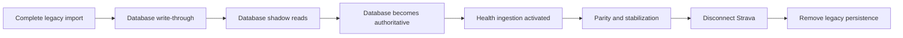

# Sub4 Database Cutover and Strava Retirement Plan

**Status:** Proposed  
**Date:** 5 August 2026  
**Objective:** Move Sub4 to a source-neutral SQLite database, ingest all new activity data through Apple Health, preserve the usable historical record, and retire Strava without breaking the app.

## Executive decision

Sub4 is not ready to disconnect Strava today. The safe sequence is:

1. Complete legacy-data coverage.
2. Make SQLite continuously current.
3. Prove database reads against the legacy stores.
4. Make SQLite authoritative.
5. Implement durable Apple Health ingestion.
6. Prove Health operation during a shadow period.
7. Rehearse the disconnected state.
8. Revoke Strava and retire its code.

Database activation and Strava retirement are separate, independently reversible decisions.

## Definition of “all data”

“All data is in the database” means every authoritative domain record is represented in SQLite. It does not mean credentials, replaceable UI preferences, transport JSON, or build assets are forced into it.

| Data | Authoritative location |
|---|---|
| Activities and source records | SQLite |
| Details, laps, splits and best efforts | SQLite |
| Routes, heart rate, power, speed and other samples | SQLite |
| HealthKit workouts, events and revisions | SQLite |
| Notes, reviews, proposals and evidence lineage | SQLite |
| Match decisions and corrections | SQLite |
| Weather and provenance | SQLite |
| Athlete profile, zones, FTP and resting heart rate | SQLite |
| Gear and activity-gear references | SQLite |
| Plans, sessions, content versions and history | SQLite |
| Sync checkpoints, retry work and rejection receipts | SQLite |
| Export, deletion and disconnect receipts | SQLite |
| Small, replaceable UI preferences | UserDefaults |
| Tokens and API credentials | Keychain |
| Bundled `plan.json` | Versioned seed input only |
| Legacy runtime JSON | Read-only recovery input until retirement |

## Phase 1 — Finish database coverage

Complete the remaining D5 work.

### Work

- Implement `lifecycle_event` and `lifecycle_line` writes for export, deletion, Strava disconnect, and recovery.
- Populate `review_evidence_source` whenever a review is created.
- Use `content_revision` for genuine content identities, beginning with the plan content hash. Do not use it for unrelated schema flags.
- Inventory every Application Support file and domain-significant UserDefaults key again.
- Add a test that fails when a new persistent store is absent from the storage contract.
- Take a fresh protected snapshot immediately before the final historical import.

### Exit gate

- Every authoritative legacy store maps to a table or has an approved reason to remain outside SQLite.
- There are no unexplained empty database tables.
- There are no unreadable legacy inputs.
- Import is repeatable and idempotent.
- Semantic verification passes against the real phone dataset.

## Phase 2 — Build production database repositories

The existing importer creates a database snapshot. It is not a runtime persistence layer. Add source-neutral repositories such as:

- `ActivityRepository`
- `RecordingRepository`
- `ActivityDetailRepository`
- `AthleteRepository`
- `PlanRepository`
- `NoteRepository`
- `ReviewRepository`
- `CorrectionRepository`
- `WeatherRepository`
- `SyncRepository`

Each repository must:

- Read from SQLite.
- Write related records in one transaction.
- Use canonical UUIDs internally.
- Resolve provider identifiers through `source_record` and `activity_alias`.
- Return domain models rather than database rows.
- Report database errors instead of returning an apparently valid empty collection.
- Scope records by account.
- Have in-memory database tests.

### Ingestion transaction

A new-activity transaction should atomically update:

- Canonical activity
- Source record and alias
- Detail and recording rows
- Samples and events
- Gear references
- Corrections or rejection receipt
- Work-queue state
- Exact source checkpoint
- Content revision or ingestion receipt

The checkpoint must not advance if the associated data transaction fails.

### Exit gate

- All repositories have success, failure, idempotency and interruption tests.
- No production feature has to decode JSON to obtain domain data.

## Phase 3 — Add database-first write-through

Before switching reads, make every existing mutation update SQLite.

### Work

- Write Strava activity sync results through `ActivityRepository`.
- Write detail and stream downloads directly to SQLite.
- Write notes, match decisions, commutes and proposals to SQLite.
- Write athlete data, zones, gear, weather and plan changes to SQLite.
- Write retries, checkpoints and rejection receipts to SQLite.
- Keep legacy JSON writes temporarily as rollback mirrors.
- Put database and mirror writes behind one coordinator so divergence is visible.
- Treat a database write failure as a visible sync failure.

Use this order:

1. Validate input.
2. Commit the SQLite transaction.
3. Update the temporary legacy mirror.
4. Record a mirror failure without rolling back committed canonical data.

### Exit gate

- After normal app use, another legacy import produces no new database changes.
- SQLite stays current without pressing the manual import button.

## Phase 4 — Run database shadow reads

Execute SQLite reads beside legacy reads while leaving the legacy result visible to the user.

### Compare

- Activity identities and ordering
- Day grouping and time zones
- Details, laps, splits and traces
- Notes and corrections
- Plan matching
- Daily and weekly distance
- Training load, PMC and monotony
- Pace and heart-rate-zone calculations
- Weather and gear
- Review payloads
- Today, Week, Plan and Progress summaries

Comparisons must cover semantic values, not just counts. Equal counts can hide changed values or swapped identities.

Each diagnostic must show:

- Compared record count
- Exact mismatches
- Expected differences
- Unexplained differences
- Last successful comparison time
- Database and legacy revisions compared

### Exit gate

- Zero unexplained divergence across the full real dataset.
- Zero unexplained divergence after multiple new syncs and authored edits.
- Derived metrics agree within documented numerical tolerances.

## Phase 5 — Activate database reads

Switch one bounded feature at a time:

1. Plan and athlete profile
2. Notes and authored decisions
3. Activity summaries
4. Details and recordings
5. Weather and gear
6. Derived metrics
7. Reviews and proposals
8. Sync and retry state

Use independently reversible feature flags during activation.

### Required changes

- Set `Sub4Launch.migrationFailureBlocksTheApp` to `true`.
- Show a recovery screen if SQLite cannot open or migrate.
- Require the latest migration ledger entry to be `verified`.
- Mark it `activated` as part of cutover.
- Stop production reads from JSON.
- Keep legacy files read-only during stabilization.
- Prevent stores from recreating retired files after deletion.

### Exit gate

- The app launches and all features work with legacy JSON temporarily removed from the runtime location.
- Restoring the files is no longer required for normal operation.

## Phase 6 — Implement durable HealthKit ingestion

HealthKit ingestion is required before Strava can be disconnected.

### Requirements

- Use anchored HealthKit queries.
- Persist an anchor only after its batch commits.
- Handle new, updated and deleted workouts.
- Ingest routes, heart rate, distance, speed, cycling metrics, power, calories, and workout events where available.
- Record source revision and device metadata.
- Store the HealthKit UUID as a source identifier, never as the canonical activity ID.
- Retain measured values separately from derived values.
- Record field-level provenance.
- Make ingestion idempotent, interruption-safe and retryable.
- Distinguish denied authorization, unavailable types, timeout, query failure and a genuinely empty result.
- Never advance an anchor after partial failure.

### Identity and deduplication

When Health and historical Strava describe the same workout:

1. Match the Health record to the existing canonical activity.
2. Add a Health source record to that activity.
3. Preserve historical Strava provenance.
4. Apply explicit field-level rules to prefer the appropriate source.
5. Do not duplicate the activity because external identifiers differ.
6. Send ambiguous matches to user review.

Matching should consider account, sport, UTC start, local day, duration, distance, route similarity and device/source metadata.

### Non-Health gaps

HealthKit may not reproduce:

- Activity titles
- Shoes and bikes
- Commute and trainer flags
- Head-unit recordings not written to Health
- Strava achievements or segments

Preserve permitted historical metadata, support manual metadata, or add FIT/TCX import as appropriate. Do not manufacture replacement values.

### Exit gate

- New real workouts appear in SQLite and across the complete UI without Strava.

## Phase 7 — Run a Health/Strava shadow period

Temporarily ingest both sources for comparison, subject to the project’s Strava policy gates.

Validate that:

- Every expected workout appears.
- No duplicates reach the user.
- Late Health records are incorporated.
- Updates and deletions reconcile correctly.
- Routes and samples attach to the correct activity.
- Plan matching remains stable.
- Load and progress calculations use Health lineage.
- Reviews no longer depend on Strava-derived evidence.

The observation window must include:

- A run
- A ride
- A swim
- A strength workout
- A paused workout
- A workout recorded by another app or device
- A delayed or edited workout

### Exit gate

- All listed cases pass without manual database repair.

## Phase 8 — Rehearse the disconnected state

### Procedure

1. Take and verify a protected backup.
2. Disable all Strava sync gates.
3. Remove network access from the test build where practical.
4. Keep credentials temporarily so rollback remains possible.
5. Run the app for the agreed stabilization window.
6. Record new activities through Health.
7. Exercise every major feature.
8. Export the complete database and verify the export.
9. Test deletion and restoration on a non-production installation if supported.

### Acceptance checklist

- App launches offline.
- Historical activities remain available.
- New Health activities arrive.
- Routes, details and charts work.
- Notes and corrections persist.
- Plan matching and load calculations update.
- Monthly review works without prohibited Strava-derived evidence.
- Background ingestion works.
- Database backup and export work.
- No normal screen reads legacy JSON.
- No feature requests data from Strava.

## Phase 9 — Disconnect Strava

After the rehearsal passes:

1. Record a disconnect lifecycle event.
2. Stop foreground and background Strava sync.
3. Cancel pending Strava work.
4. Revoke the OAuth token with Strava.
5. Remove access and refresh tokens from Keychain.
6. Preserve permitted canonical history and provenance according to the approved policy.
7. Remove data that cannot legally remain.
8. Show a receipt explaining what was kept, transformed or deleted.
9. Verify Health ingestion immediately afterward.

This must be a dedicated operation, not a generic cache reset.

## Phase 10 — Retire legacy persistence and Strava code

After one stable release window:

- Remove JSON runtime readers and writers.
- Remove obsolete domain-significant UserDefaults keys.
- Remove Strava networking, OAuth UI and background tasks.
- Remove Strava-specific assumptions from domain models.
- Retain a separately tested recovery importer only if required.
- Remove legacy files through a versioned cleanup migration.
- Keep the protected recovery snapshot until the approved retention point.
- Update privacy disclosures, diagnostics and support documentation.

## Mandatory release gates

Strava may be disconnected only when every answer is **yes**:

- [ ] Is SQLite continuously current without manual import?
- [ ] Are all production reads served from SQLite?
- [ ] Does database failure block misleading empty-state operation?
- [ ] Is the latest migration verified and activated?
- [ ] Are there zero unexplained shadow-read differences?
- [ ] Does HealthKit durably ingest new, updated and deleted workouts?
- [ ] Do background Health updates work?
- [ ] Can duplicate Health and Strava records be canonicalized?
- [ ] Do all main UI surfaces work without network access?
- [ ] Are calculations and reviews rebuilt from allowed sources?
- [ ] Have protected backup and export both been verified?
- [ ] Has the disconnect rehearsal completed successfully?
- [ ] Can every record retained or deleted at disconnect be explained?

## Immediate implementation backlog

Execute in this order:

1. Finish D5 lifecycle, review-lineage and content-revision coverage.
2. Add repository protocols and SQLite implementations.
3. Convert existing writes to database-first write-through.
4. Build semantic shadow-read diagnostics.
5. Activate database reads one slice at a time.
6. Implement anchored HealthKit ingestion.
7. Reconcile Health records with historical canonical activities.
8. Rebuild calculations and reviews using Health provenance.
9. Conduct the disconnected-state rehearsal.
10. Disconnect Strava.
11. Stabilize, then remove JSON and Strava code.

## Final success condition

The historical import passing is not the disconnect gate. The project is complete only when SQLite remains authoritative and continuously current while Apple Health—not Strava—reliably supplies every new workout needed by the fully functioning app.
